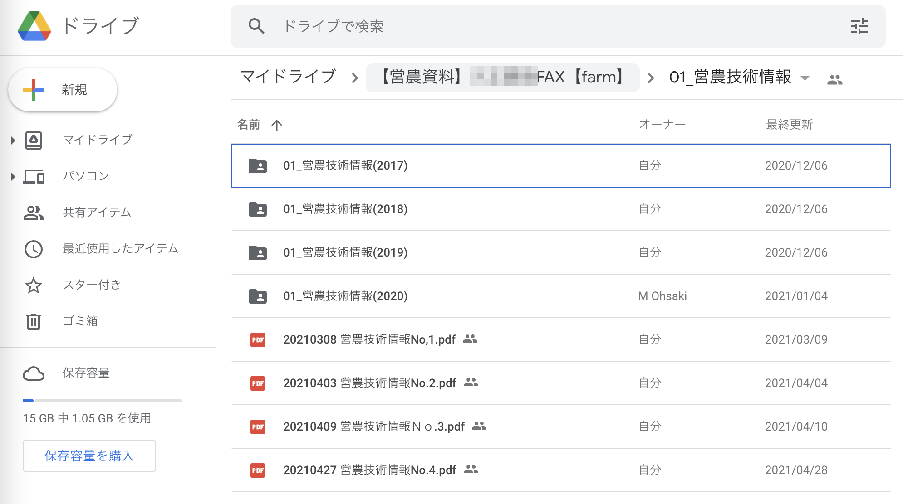
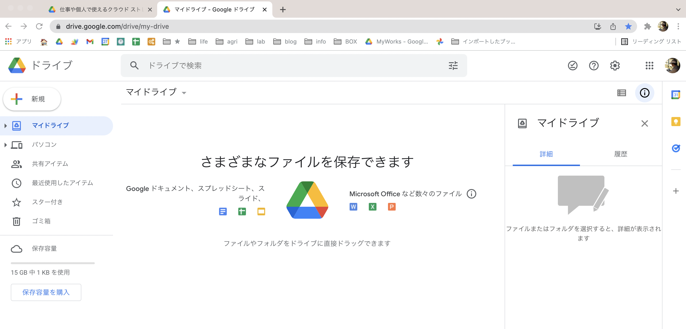
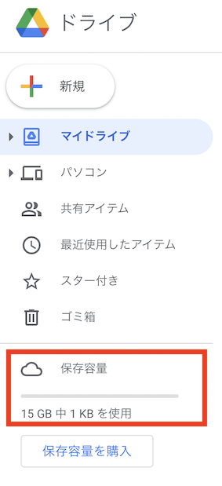

こんにちは！  
おおさき（[@massa_potato](https://twitter.com/massa_potato)）です。

突然ですが、皆さんは普段パソコンで作成したファイルや仕事で必要な資料などをどのように管理していますか？

パソコンにそのまま保存している方も多いと思いますが、最近では「クラウドストレージ」と呼ばれる、インターネットを使ってファイルの保存・共有ができるアプリもたくさんあります。

例えば、現場作業に出ているタイミングで、家にある資料を確認したくなる時もあるかと思います。

そんな時にとても便利なサービスの一つが、今回お話する **「Googleドライブ」** です。

今回の記事では、このGoogleドライブの特徴と始め方をカンタンにご紹介したいと思います。

これから始める方向けの記事になりますので、既に知っているよという方、導入が済んでいる方は飛ばしてくださいね。



## Googleドライブとは

Googleドライブは簡単に言うと、Google社が提供している **「インターネット経由でファイルの保存場所を提供してくれているサービス」** です。

ファイルの保存場所というのは、パソコンに保存する際のフォルダみたいなイメージを持ってもらえると良いかなと思います。

似たサービスに「Dropbox」や「iCloud」などがありますね。  
これらは実際に使っている方も多くいらっしゃるのではないでしょうか？

冒頭でも触れた通り、このようなファイル共有の仕組みは一般に **「クラウドストレージ」** と呼ばれていて、Googleドライブもこの仲間、ということになります。

Googleドライブを活用するのはとても簡単で、Googleアカウント（Gmailアドレス）さえ準備しておけば、誰でも基本的には無料で使い始める事ができます。

ガッツリ使う方向けの有料プランもありますが、無料でも15GBの容量があるため（2022年1月時点)、個人用途なら無料でも十分活用することができるのかなと思います。

このように準備も簡単で、しかも無料で様々な便利サービスを使えるのがGoogleドライブの特徴です。

## Googleドライブを使う利点

Googleドライブを活用すると、ざっくり次のような事ができるようになります。
   
**(1)複数の端末からファイルを開く事ができる**

**(2)他の人ともファイル共有が簡単にできる**

**(3)「スプレッドシート」「フォーム」など様々な機能を活用できる**
   
1つ目と2つ目は、どちらかというとクラウドストレージの一般的な利点ですね。  
一方で3つ目は、Googleサービスならではの利点になります。

例えば僕は基本的に、受け取った営農に必要なFAX資料やすぐに取り出したい情報はpdfにして、このGoogleドライブに一元化するようにしています。  

そうすることで、資料が必要になった時にスマホからサッと確認することができるようになるし、農場内での情報共有も簡単になるのです。

それぞれの利点を、具体的に紹介していきますね。

<h3>(1)複数の端末からファイルを開く事ができる</h3>

冒頭でもお伝えした通り、インターネットの繋がっている場所なら自分の持っているスマホやタブレット、パソコンなどどれからでもファイルを閲覧・編集する事ができます。

いつでもどこでも同じ資料を確認できるのはとても便利ですね。

*⬇︎図：いつでも資料を確認*

<h3>(2)他の人ともファイル共有が簡単にできる</h3>

自分だけでなく、他の人と共有したい場合にもクラウドストレージはとても便利です。  
保存したファイルごとに共有のためのURLリンクが作成されるので、そのURLをコピーしてメールやLINEで送ってあげれば良いのです。

例えば「一部のグループメンバーでワード・エクセル資料を共同で編集」して「他のメンバーは閲覧のみ」みたいな場合でも、バッチリ対応できます。

*⬇︎図：ファイルの共有もリンクで簡単*

<h3>(3)「ドキュメント」「スプレッドシート」など様々な機能を活用できる</h3>

Googleドライブを使うことで、ファイル共有だけでない便利なGoogleサービスを利用することが簡単にできるようになります。

例えば、先程挙げたワードファイルの共同編集には、Microsoftのワードと互換性のある「Googleドキュメント」を使います。  
簡単にWeb上でアンケートを取る事ができる「Googleフォーム」なんかも特徴的です。  
これらはどれもWebブラウザでとても手軽に使う事ができます。

*⬇︎図：Googleドキュメントで資料作成*

当ブログでは、データの整理やちょっとしたアプリ制作に **「Googleスプレッドシート」** という表計算ができるサービスをフル活用していくことになります。

これはちょっとした自動化を行うGASプログラミングやノーコードアプリ制作ともとても相性が良いので、ぜひ活用していきましょう！

## Googleドライブを始めよう

解説はこのくらいにして、ここからはGoogleドライブを実際に使っていきましょう。

ドライブを使うには **Googleアカウント（Gmailアドレス）** が必要になるので、持っていない人は[こちら](https://accounts.google.com/signup/v2/webcreateaccount?continue=https%3A%2F%2Faccounts.google.com%2FManageAccount%3Fnc%3D1&hl=ja&flowName=GlifWebSignIn&flowEntry=SignUp)から準備しておいてくださいね。

アカウントが準備できたら、 **まずはブラウザで「Googleドライブ」と検索、または下記のリンクにアクセス** してください。

[仕事や個人で使えるクラウド ストレージ - Google ドライブ](https://www.google.com/intl/ja_jp/drive/)

Googleドライブの公式サイトが開かれます。

右上か左下に表示されている **「ドライブに移動」** をクリックしてみましょう。

すると、次の画像のように「マイドライブ」という自分のアカウントのGoogleドライブにアクセスすることができます。

これだけで、ドライブ利用することができます。とても簡単ですね。

今は何もデータがないので空っぽですが、ここにどんどん自分のファイルを作成していくことになります。

## メニューを確認してみよう

左側のメニューのようなところを眺めてみましょう。

下の方に **「保存容量」** という項目がありますね。

最初の方で紹介した通り、無料プランではこのドライブに合計15GBまでのファイルを保存することができます。

これはGoogleアカウントごとの容量なので、仮にもう1つ自分のアカウントを作成すれば、実質さらに15GBのストレージが無料で活用できちゃいます。

メニューの下の「保存容量を購入」から有料プランに変更して保存容量を増やすことができますが、僕も無料プランで十分活用できているので、はじめのうちは無料のままで十分だと思います。

それでは次に、メニューの一番上にある **「＋新規」** をクリックしてみましょう。

すると、下図のように色々な項目が出現します。

このメニューから、自身で新しくファイルやフォルダを作成することができます。

手元のパソコンにあるファイルやフォルダをこのドライブに入れる（アップロードする）こともできますし、「ドキュメント」「スプレッドシート」などのGoogleサービスのファイルを新規作成することができます。

これらの詳しい活用については、別記事で見てくことにしましょう。

## おわりに

さて、今回の記事では、Googleドライブの特徴と導入の仕方を解説しました。

当ブログでは、主にこのドライブとスプレッドシートを利用して農場の情報を整理していきますので、ぜひ試してみてくださいね。

次回は早速、「スプレッドシート」を使っていきたいと思います。