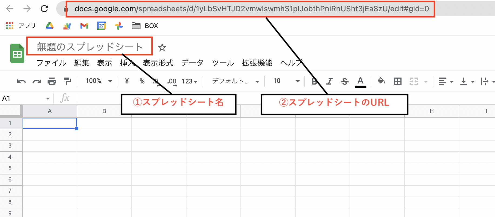
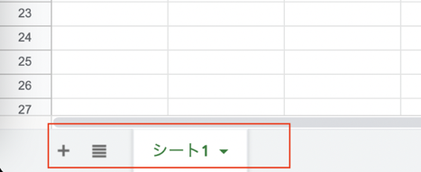
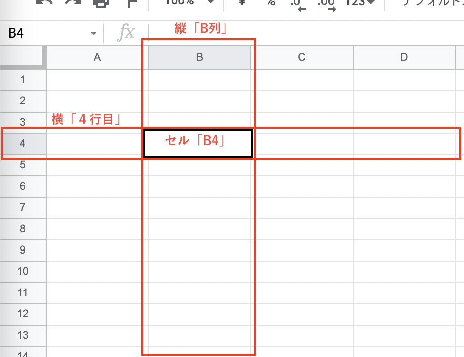

こんにちは！  
おおさき（[@massa_potato](https://twitter.com/massa_potato)）です。

今回の記事では、アプリ制作のためのデータ管理に便利な **「Googleスプレッドシート」** の特徴と始め方について、初心者向けに解説していきます。

おそらく 「たまにエクセルを使うことがある」というような方にとっては、表計算ソフトの基本をおさらいしながらスプレッドシートの導入ができる内容かな、と思います。  

一方で業務で既にエクセルをバリバリ使っているという方には、だいぶ物足りない内容だと思います。適度に飛ばしちゃってください。

スプレッドシートを始めるには、事前準備としてGoogleアカウントが必要になります。  
また「Googleドライブ」の中にスプレッドシートを作成していくことになるので、これらアカウントやドライブの準備がまだの方は、前回記事を参考に用意しておいてくださいね。

それでは、見ていきましょう！



## Googleスプレッドシートとは

まず、これから活用していく「Googleスプレッドシート」について簡単に解説していきます。

スプレッドシートは一言で言うと、 **Google社が提供している「表計算ソフト（アプリ）」** のことです。

表計算ソフトというと、Microsoftのエクセルのようなズラーっとマス目が並んだ画面をまず思い浮かべるかと思います。  

スプレッドシートもその仲間なので、ひとまずは「だいたい同じような画面で同じような仕事ができる」とイメージしておいてください。

このスプレッドシートはGoogleドライブ同様、無料で活用できちゃいます。

またブラウザ上で動かせるためインストールが不要なので、WindowsやMacなど、どのOSを使っていてもすぐに使い始めることができるのが特徴です。

## 表計算ソフトの役割とできること

ところで、そもそも「表計算ソフト」を使うとどんなことができるのでしょうか？

一度ここで、改めてその役割を確認しておきましょう

表計算ソフトとは **「数値データの集計・分析に用いられるアプリケーションソフトウェア」** のことです。  
（引用：[Wikipedia](https://ja.wikipedia.org/wiki/%E8%A1%A8%E8%A8%88%E7%AE%97%E3%82%BD%E3%83%95%E3%83%88)）

めんどくさい複雑な計算や集計などを自動で行ってくれたり、数値データに限らず綺麗にレイアウトした見やすい表を作ったり、グラフやカテゴリごとの集計表を作成して分析することができる・・・などなど、使いこなせるようになるととても便利なツールです。

・・・というのが本来の表計算ソフトの役割なのですが、このブログでは複雑な計算をしたりグラフを作ったり、という使い方については、基本的には触れません。

それよりも、 **身の回りのデータを管理できる「簡易的なデータベース」** として表を使っていく、という活用がメインになってきます。

>  **【NOTE】**   
> データベースという用語についての詳細は省きますが、ここでは **「パソコンが扱いやすいデジタルデータの形で身の回りの情報を整理して、いつでも追加したり取り出しやすくできるもの」** くらいのイメージで捉えておけばバッチリです。

## スプレッドシートの大きな特徴

話をスプレッドシートに戻しますね。  

先ほど、スプレッドシートもエクセルも同じような仕事ができる表計算ソフトである、というお話をしました。

ですが、できることは同じでもそれぞれ違った特徴があります。  
どちらも得意・不得意な分野があるのですね。

スプレッドシートの大きな特徴は **「インターネットを使って全ての機能を活用できる」** という部分です。

これによるメリットとしては、   
- **複数端末で利用できる**  
- **複数人での共有・共同編集も簡単にできる**  
- **他のGoogleサービスやアプリとの連携がやりやすい**

というようなことが挙げられます。

・・・なんだか、[前回記事](https://nouka-it.com/blog/2022/01/drive-intro/)で見たドライブの利点と似ていると思いませんか？

それもそのはず、作成したファイルは自身のドライブの中に保存されるため、ドライブの利点がそのままスプレッドシートの利点にもなるのです。

一方で、スプレッドシートのデメリットもいくつかあります。

- **通信環境によりエクセルよりも操作が遅い場合がある**  
- **印刷の設定があまり細かくできない**

それぞれ使い込んでいくともっと色々と違いはあるので、用途によって使い分けるのがベストですね。

このブログの目的は、ITツールによる身の回りのデジタル化です。  
そのためには、 **インターネットを通じて他のアプリと連携しやすいスプレッドシートを使うのをオススメ** します。

## スプレッドシートを新規作成してみよう

さて、解説ばかりが続いてしまいました。  
ここからは実際にスプレッドシートを扱ってみましょう。

今回はさわりだけですが、スプレッドシートを新規作成してみたいと思います。

[前回記事](https://nouka-it.com/blog/2022/01/drive-intro/#%E3%83%A1%E3%83%8B%E3%83%A5%E3%83%BC%E3%82%92%E7%A2%BA%E8%AA%8D%E3%81%97%E3%81%A6%E3%81%BF%E3%82%8B)の続きで、ブラウザに「マイドライブ」が表示されている状態から始めていきます。

ページの左上にある **「＋新規」** をクリックして、出てくるメニューの「Googleスプレッドシート」から「空白のスプレッドシート」を選択してみてください。  
（「Googleスプレッドシート」をクリックするだけでも大丈夫です。）

するとブラウザに新しいタブが開かれて、このような表がズラーっと並んだ画面が出てきましたね。

これだけで、スプレッドシートの新規作成が完了です。

## 抑えておきたい３つの要素

ここで、スプレッドシートを扱う上で最低限知っておきたい要素を簡単に整理しておきますね。

大きく、次の３つの要素を抑えておくと良いでしょう。

**(１)スプレッドシート**  
**(２)シート**  
**(３)セル**  

表計算ソフトを使ったことのある方なら知っていると思うので、おさらいのつもりで見てみていただけたらと思います。

画面上で見ると、それぞれ以下の場所が対応しているイメージです。

<h3>(１)スプレッドシート</h3>

まず「スプレッドシート」は一番大きなくくりで、 **このスプレッドシートのファイル全体** を指します。例えると、１冊のノートみたいなイメージです。

エクセルでいうと「ブック」「ワークブック」と呼ばれる、１つのエクセルファイルに当たります。

左上の「無題のスプレッドシート」と表示されているのがこのスプレッドシート名になり、この名前がそのままドライブに保存されるファイル名になります。

また、作成したスプレッドシートには自動でURLが割り振られていて、それによりブラウザ上で表示できるようになっています。

<h3>(２)シート</h3>

次に「シート」は、**スプレッドシートを構成する表形式の領域** のことです。  
スプレッドシートがノートとすると、シートは各ページに対応するイメージでしょうか。  

エクセルでも同じく「シート」または「ワークシート」と呼ばれていますね。

基本的に僕たちが画面上で作業をするのは、このシート上での作業になります。  
シートは複数作成できるので、用途に分けてデータを管理することができます。

画面の左下に「シート1」と表示されているのが、シート名にあたります。 ＋マークからシートを増やすことが可能です。

<h3>(３)セル</h3>

最後に、「セル」と呼ばれる部分は、シートの中の **縦と横の網目状に整列している１つ１つの領域** です。  
マス目入りのノートを想像していただくと、開いたページのマス目一つ一つがセルにあたるイメージでしょうか。

これはエクセルでも全く同じ呼び方ですね。

セルは、縦の「列」と横の「行」が交差する番号で表されます。

列にはアルファベット、行には数字がそれぞれ割り振られていて、この組み合わせで１つのセルが特定できるようになっています。

住所の番地みたいなもので、例えばセル「B4」というと「B列4行目」にあるセルを表すことになります。

ざっとこんなところでしょうか。

次回はこのあたりを踏まえて、スプレッドシートへのデータ入力を試していきたいと思います。

## おわりに

以上、これから始める方向けに、Googleスプレッドシートの特徴と、基本的なところを見てきました。

次回はスプレッドシートへのデータの入力をしながら、パソコンが扱いやすいデータ形式である「構造化データ」という大事な考え方について、学んでいきたいと思います！  