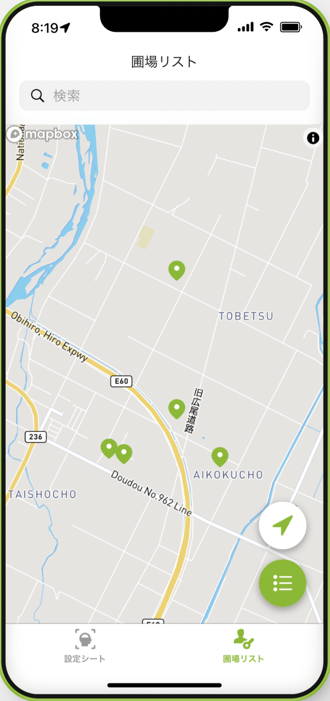
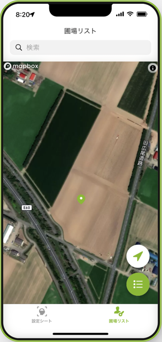
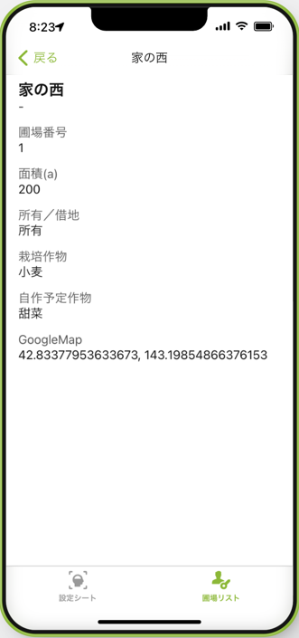

今回から数回に分けて、 **ノーコード開発ツール「Glide」** を活用したちょっとしたアプリを作ってみたいと思います。

Glideは、 **Googleスプレッドシートに用意したデータをもとにサクッとWebやスマホ上で動くアプリを作ることができる、便利なアプリ制作ツール** の一つです。

ノーコードなので、プログラミングも不要。  
一度使い方に慣れれば、アイデア次第でちょっとしたツールがすぐにできちゃいます。

今回の記事では、これから制作していくアプリの概要などについてお伝えします。  

それでは早速、みていきましょう！



## 今回作りたいアプリについて

### 概要

スマホで確認できる「圃場台帳アプリ」を作成します。

**スプレッドシートで作成した「圃場台帳」をもとに、農場の圃場・・・すなわち管理している農地の情報をマップに表示する**、というカンタンなアプリを作成してみたいと思います。

制作したアプリはWebブラウザやスマホアプリとして自身で活用したり、仕事のチームで共有したりすることが可能になります。

具体的に、どんなものか見てみましょう！

### 全体像

アプリを開くと下部には

1.  **「圃場リスト」**

2.  **「設定」**

の２つのタブがあります。これが各画面に対応しています。

まず **「圃場リスト」** 画面では、このようにスプレッドシートに入力した農地の場所をマップ上にピンで表示します。

マップは拡大したり衛星画像でも見ることができます！  

これだけで、ちょっと面白そうじゃないですか？  
（ただ、リアルタイムの衛星画像ではないので注意。）  

各圃場の詳細な情報についても確認することができます。  
作付や面積、圃場番号の確認をしたり、チームでの情報共有に役立てることができそうです。

もう一つの **「設定」** 画面では、農場の情報などを表示するようにします。

たったこれだけのカンタンなアプリを制作してみたいと思います。

### 補足

ノーコード開発ツールの良いところは、このようなイチから作るには難しそうなデザインも、あらかじめ用意されているパーツを組み合わせて短時間で作ることができる点です。  

・・・ただ、もしかしたら **「表示するだけ？もっと多くの機能をつけたい！」** と物足りなく思う方もいるかもしれませんね。

ですがまずはアプリ制作を体験して欲しいので、最初はあまり色んな機能を持たせずに、情報を表示するだけのアプリを作ってみることにしましょう。

のちのち、アプリ上でデータの追加・編集ができる機能なんかも後から追加できます。後からいくらでもカスタマイズできますので、慣れてきたらぜひトライしてみましょう！

## なぜ圃場台帳アプリ？どう活用するの？

なぜ、このような圃場台帳が必要なのでしょうか？ スマホアプリにしておくと何に役立つのでしょうか？

ざっと挙げてみると、

- **チームで圃場の場所を共有できる**
- **事務書類の提出時に、圃場番号や作付をすぐに確認できる**
- **作付計画に役立てられる**

というような活用が考えられます。

僕も自作して使っているのですが、生産履歴や共済の提出などで圃場番号・作付を求められたときに、いちいち過去の資料を引っ張り出さなくても良くなり、それだけでもだいぶストレスを減らすことができました。

実は、このような土地管理が必要な背景の一つに、日本の農地の課題があります。

それぞれの農家の所有地はまとまっていることが少なく、小さな面積の農地があちこちに分散していることが多い、と言うのが現状です。

（難しい言葉ですが、これは **「分散錯圃（ぶんさんさくほ）」** と呼ばれているようです。）

土地が分散していることで省力化しづらいだけでなく、離れている土地での作業忘れや作業の重複、チームでの情報共有の難しさがあるのですね。  

そういった課題解決のために、このようなアプリを自作して活用することができます。

## 使用するデータについて

Glideでアプリ制作をするためには、 **はじめにスプレッドシートでしっかりとデータを用意しておくのがポイント** です。  

今回のアプリでは、スプレッドシートで作成した「圃場台帳」のデータを使います。   
スプレッドシートでのデータ作成の方法は、下記の記事で紹介しています。

ただ、各圃場の場所をアプリでマップ上に表示するために、少しデータに一工夫加える必要があります。  

なので実際に使うデータについては次回、改めてサンプルデータを使いながら準備していきますね。

## まとめ

さて、今回はこれから作っていく「圃場台帳アプリ」の概要について、見てきました。

ノーコードツールGlideの基本機能でできる、とてもシンプルなアプリです。  
やり方を覚えたら色々とカスタマイズもできるようになりますので、ぜひ楽しみながら作っていきましょう！

次回は、Glideを始める前にスプレッドシートのデータを準備していきたいと思います。