本シリーズは、**ノーコード開発ツール「Glide」** を使ってはじめてのアプリ制作をしていくシリーズです。  
農場のマップを表示する「圃場台帳アプリ」を題材に、スプレッドシートでのデータの持ち方やアプリの作り方を学んでいきます。

[■「はじめてのGlide」一連の記事はコチラ](https://nouka-it.com/categories/%E3%81%AF%E3%81%98%E3%82%81%E3%81%A6%E3%81%AEglide/)

前回の記事で、これから制作していきたいアプリの概要を、現場での課題感も交えながら紹介しました。

今回は、**Glideでアプリ制作をするために必要なデータをスプレッドシートで準備**していきたいと思います。  

・・・といっても、どんなデータを用意したら良いのか、最初は難しいですよね。

このブログではまずはGlideでサクッとアプリ制作ができることを体感していただきたいので、僕の方でサンプルデータの入ったスプレッドシートを用意しました。  

本記事では、このスプレッドシートを皆さん自身のドライブにコピーして使えるようにする方法をお伝えします。  
スプレッドシートのコピーのやり方と、ドライブでのフォルダ作成のやり方を紹介しますので、既に知っているよという方は飛ばしちゃってくださいね。  

それでは、見ていきましょう！



## サンプルデータを開いてみる

さっそく、サンプルデータを開いてみましょう。  
このサンプルデータは、**今回制作する「圃場管理アプリ」に必要な情報がまとまったデータベース**にあたります。  

以下のURLリンクを開いてみてください。

[https://docs.google.com/spreadsheets/d/1C9FJe1HflN4jUFQ-Zo69KphSSxlzpmzQyZwayMEeUc8/edit?usp=sharing](https://docs.google.com/spreadsheets/d/1C9FJe1HflN4jUFQ-Zo69KphSSxlzpmzQyZwayMEeUc8/edit?usp=sharing)

リンクを開くと、このようなスプレッドシートがブラウザに表示されるかと思います。

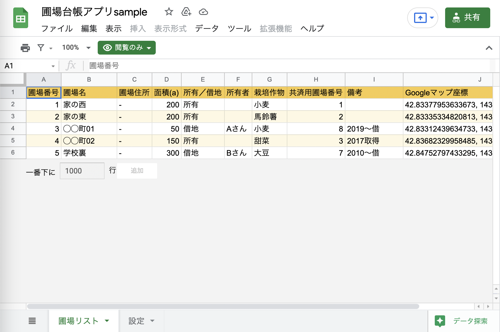

すでにデータの入ったスプレッドシートが現れましたね。

これは、僕の方で作成したスプレッドシートを **「共有機能」** を使って皆さんと共有している形になります。  

共有機能を使うとこのようにスプレッドシートに直接アクセスできるURLが発行されるので、それをメールやメッセージで送ったりシェアすることで、複数人で同一のスプレッドシートを操作することができるんです。

## 共有されたスプレッドシートを手元にコピーする方法

さて、この開いたスプレッドシートを眺めていると、何やら **メニューバーの下に「閲覧のみ」という緑色のマーク** が表示されているのに気付きましたか？

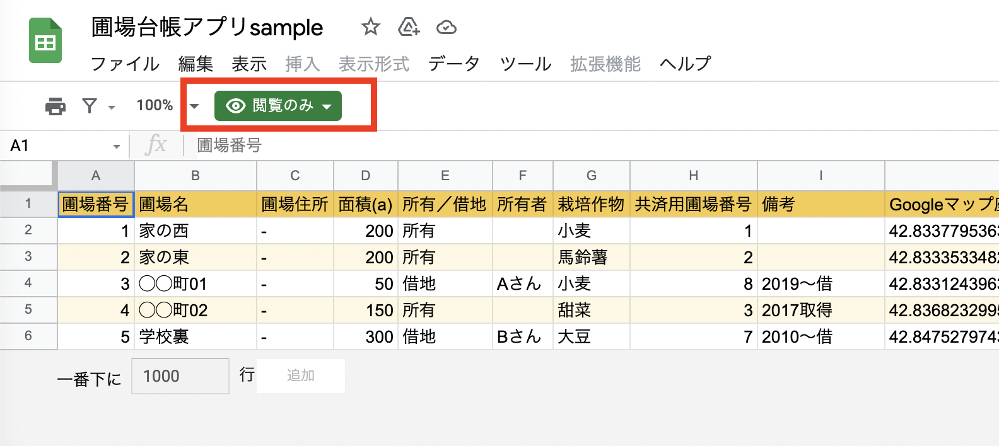

これは、このスプレッドシートの共有を「閲覧権限のみ」としているためです。  

実はこのままだと、皆さんはスプレッドシートを見ることはできますが、手元でこのスプレッドシートを編集することができません。  
試しにどこかのセルをクリックして編集しようとしても、何も入力ができないはずです。

そこで皆さんが手元でこのスプレッドシートを扱えるようにするために、自身のドライブへのコピーを作成しておく必要があります。

### (１)マイドライブにスプレッドシートのコピーを作成する

具体的なやり方を見ていきましょう。  
まずは **メニューバーの「ファイル」から「コピーを作成」を選択** してみてください。

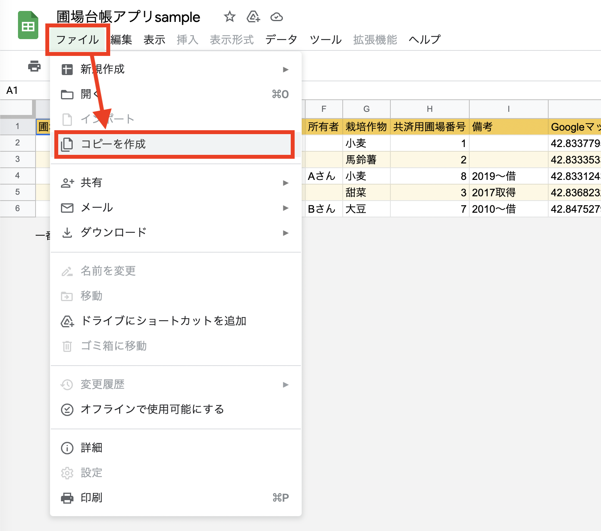

すると、このように中央にポップアップが出てきます。  

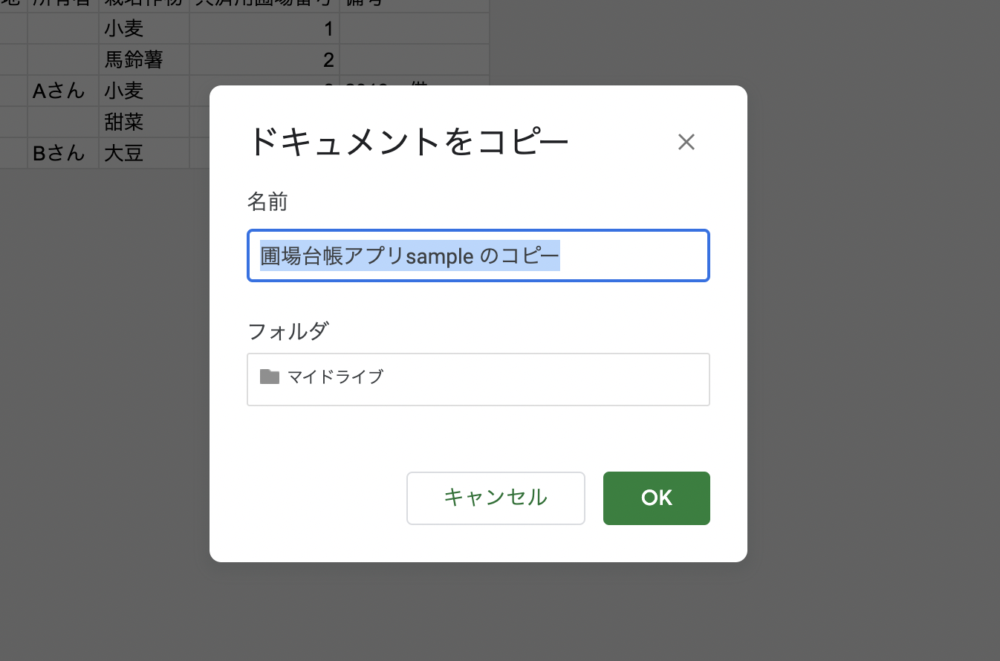

ここで、自身のドライブに保存するファイルの名前と、保存先のフォルダを決めることができます。

フォルダはとりあえずそのまま（マイドライブ）でいきましょう。  
ファイルの名前はなんでも良いのですが、ここでは「圃場台帳アプリsample」として、右下の「OK」をクリックします。

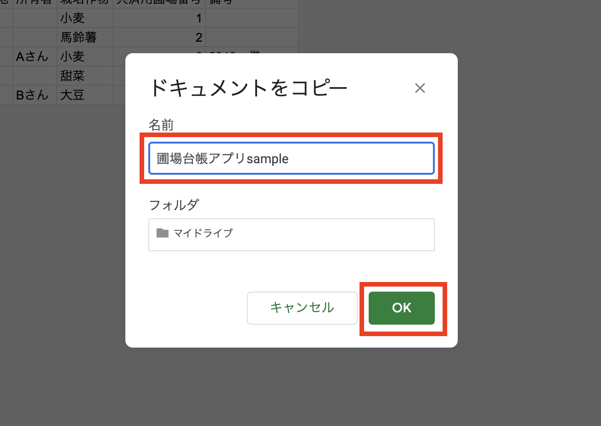

するとブラウザに新たなタブ（ページ）が開かれて、サンプルと同じ内容のスプレッドシートが開かれるはずです。

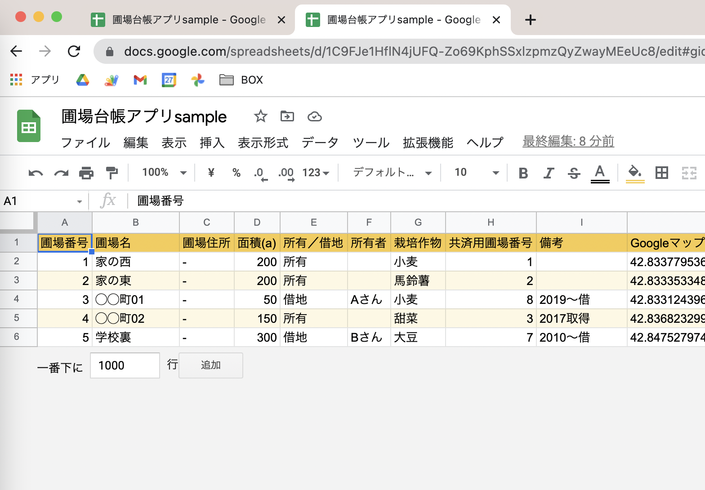

先ほどと違い、**メニューバーの下の「閲覧のみ」の緑色のマークが消えている** はずです。  
セルへの入力もできるようになっているはずなので、試しにどこかのセルを変更してみたりしてください。

コピー元のスプレッドシートを開いたままだと紛らわしいので、タブの「×」マークをクリックしてページを消して、新たにコピーしたスプレッドシートだけをブラウザに残しておきましょう。

### (２)ドライブでフォルダを作成してファイルを移動する

次に、自身のドライブで今回のアプリ制作のためのプロジェクトフォルダを作成しておきましょう。  

こうやってフォルダ分けしておくことで、今後ドライブがファイルで溢れてぐちゃぐちゃになる・・・という事態を防ぐことができるので、オススメです。  

それでは[Googleドライブのマイドライブ](https://drive.google.com/drive/my-drive)を開きます。

すると、ファイル一覧の中に先ほどコピーした「圃場台帳アプリsample」というファイルが作成されているはずです。

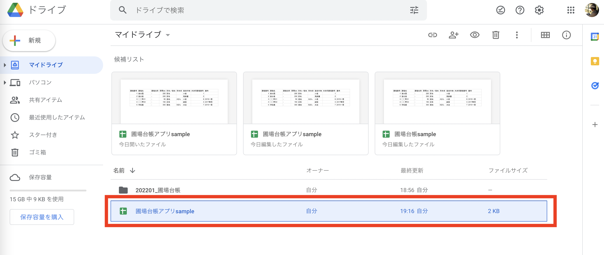

続いて今回のアプリ用のプロジェクトフォルダを作っていきます。  
左上にある **「＋新規」ボタン** から、**「フォルダ」** を選択します。

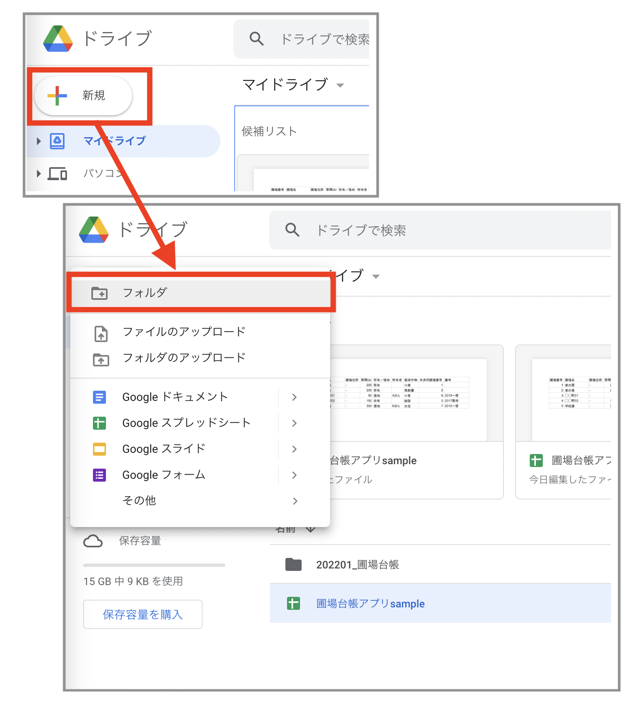

すると画面中央に「新しいフォルダ」というポップアップが表示されます。

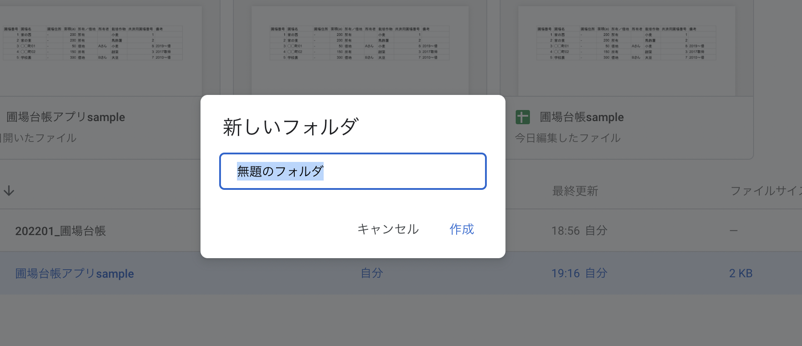

ここでフォルダ名を入力して「作成」をクリックします。  
フォルダ名は皆さんがわかればなんでも良いです。ここでは「(作成年月)_圃場台帳アプリ」としてみました。

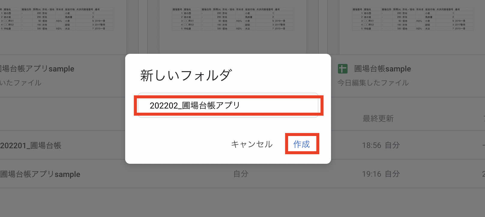

するとこのように、ドライブに新たにフォルダが作成されました。  

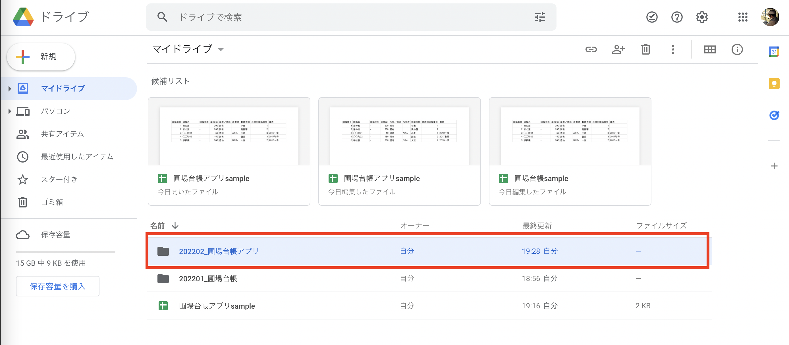

これを、今回のプロジェクトフォルダとしていきたいと思います。  
最初にコピーした「圃場台帳アプリsample」を、作成したフォルダの上までドラッグ&ドロップします。

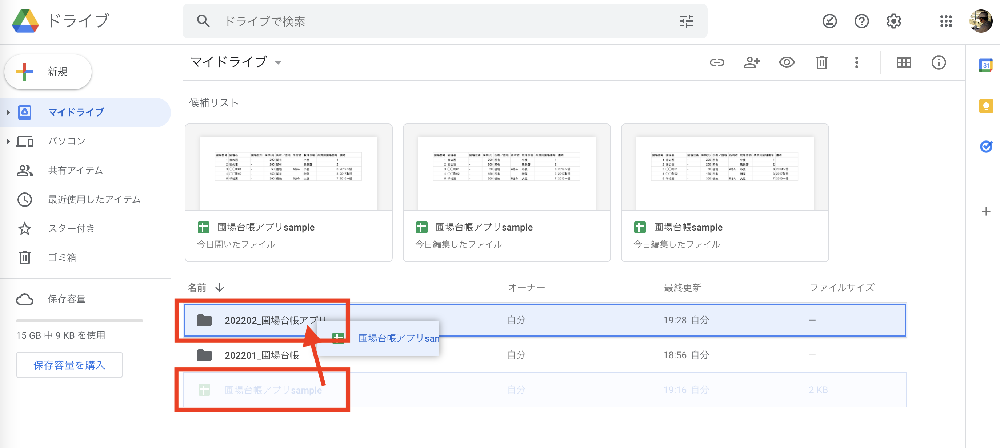

これで、ファイルの移動が完了しました。  
プロジェクトフォルダをダブルクリックして開いてみると、スプレッドシートのファイルが移動しているのが確認できます。

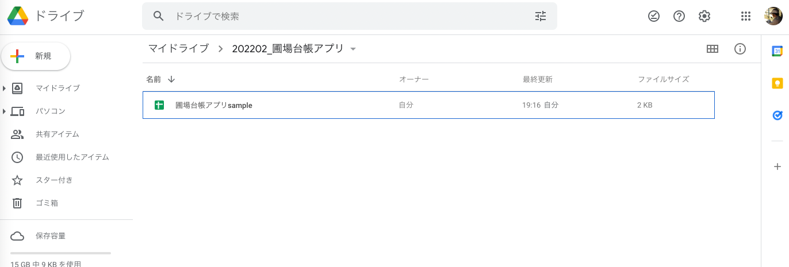

## まとめ

以上で、今回のGlideアプリを制作するためのサンプルデータの準備が完了しました。

次回は、このスプレッドシートのサンプルデータを眺めながら、Glideアプリ制作にどんなデータが必要なのか、確認しておきたいと思います。
  
  
[■「はじめてのGlide」一連の記事はコチラ](https://nouka-it.com/categories/%E3%81%AF%E3%81%98%E3%82%81%E3%81%A6%E3%81%AEglide/)