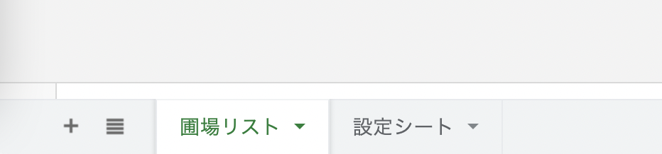
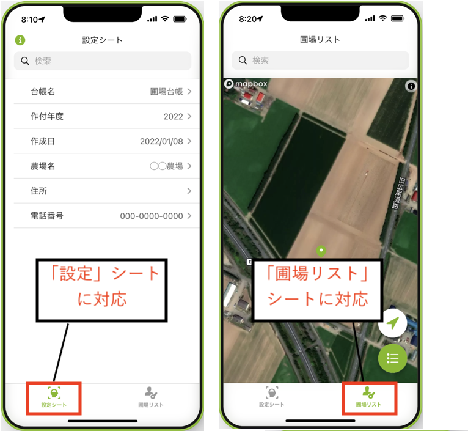
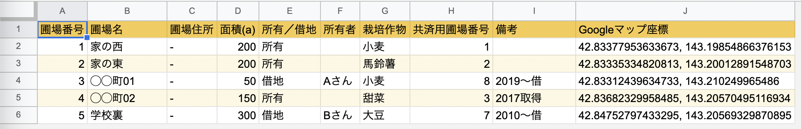
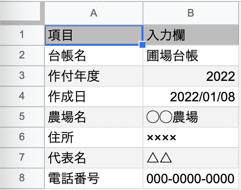

本シリーズは、**ノーコード開発ツール「Glide」** を使ってはじめてのアプリ制作をしていくシリーズです。  
農場のマップを表示する「圃場台帳アプリ」を題材に、スプレッドシートでのデータの持ち方やアプリの作り方を学んでいきます。

[■「はじめてのGlide」一連の記事はコチラ](https://nouka-it.com/categories/%E3%81%AF%E3%81%98%E3%82%81%E3%81%A6%E3%81%AEglide/)

前回の記事では、これから作りたい農場のマップ表示アプリに必要なサンプルデータの入ったスプレッドシートを、皆さんの手元にコピーするやり方を見てきました。

今回は、 **サンプルデータを眺めながら、Glideでアプリ制作をするために必要なデータとはどんなものなのか** を見ていきたいと思います。

もしかすると、「もうデータは良いから早くアプリを作りたい！」と思われるかもしれませんね。

ですが、皆さんが今後アプリ制作をしていく際には **事前にきちんとした形でデータを用意する** ことがとても重要な要素ですので、もう少々お付き合いください。  

それでは、見ていきましょう！



## 事前準備

サンプルデータとしてこちらの[Googleスプレッドシート](https://docs.google.com/spreadsheets/d/1C9FJe1HflN4jUFQ-Zo69KphSSxlzpmzQyZwayMEeUc8/edit?usp=sharing)を使っていきます。  
自身のGoogleドライブにコピーを作成して、皆さんの手元でスプレッドシートを編集できる状態におきましょう。

やり方がわからない場合は、[前回の記事](https://nouka-it.com/blog/2022/field-ledger-glideapp02/)を参考にしてみてくださいね。  

コピーが済んでいる方は[マイドライブ](https://drive.google.com/drive/u/0/my-drive)からコピーしたスプレッドシートを開いて、進めていきましょう。

## Glideアプリ制作には「データベース」が大事

では、スプレッドシートを眺めてみましょう。  

このスプレッドシートは、今回制作する「圃場管理アプリ」に必要な情報がまとまったデータベースにあたります。  

このように、**Glideではデータをスプレッドシートで用意して、それを元にアプリ制作を進めていくというのが基本** となります。  

これは言い換えると、日常使っている業務データなどをスプレッドシートでしっかり用意しておけば、ちょっとしたアプリが簡単に作ることができてしまう、とも言えますね。

## １つのシートから１つの機能ができあがるイメージで

このスプレッドシートには、「圃場リスト」シートと「設定」シートの２つのシートが用意されています。  

これらはGlideでアプリ化した際に、それぞれ画面下のタブから選択できる各画面に対応します。

それぞれの画面は「圃場リストをマップ表示する機能」「台帳や農場についての情報を表示する機能」などと役割を持っています。

**Glideアプリでは、スプレッドシートの１つのシートから１つの機能ができあがる**、というようなイメージで考えていただくと、初めのうちはデータの用意がしやすいかなと思います。  
（慣れてくると１つのシートから複数の画面を作ったり、色々な活用ができるようになりますよ！）

それでは次に、シートの中身を具体的に見ていきながら、ポイントを見ていきましょう。

## １つのシートには１つのテーブル形式のデータを

まずはシートの１枚目、「圃場リスト」のデータを見てみます。  

 

全体を眺めていただくと、データは表の形で綺麗に整理されていることがわかるかと思います。  

表形式のデータにはしっかりとルールがあり、「１行目には見出し行」「２行目以降は、１行につき１件の情報」として配置されています。  
このようなルールに従ったデータの形式のことを **「テーブル」** と呼ぶのでしたね。（[参考](https://nouka-it.com/blog/2022/spreadsheet-intro03/)）

まずはこのように、**Glideでアプリを制作するためには、１シートに１つのテーブル形式のデータを用意しておく必要がある** ということを、覚えておいてくださいね。

### 「圃場リスト」シートに必要な情報を確認する

引き続き「圃場リスト」シートのデータを具体的に見ていきます。  
このシートにはマップとして表示させたい圃場の情報がまとまって入っており、今回のアプリの一番重要な部分になります。  

A列〜I列には「圃場番号」や「圃場名」「面積」など、圃場台帳を作るにあたって必要な情報を入れるようにしています。  
この他に欲しい項目があれば皆さん自身で列を追加したり、不要な列は削除したりして構いません。

そして **J列には「Googleマップ座標」** という、何やら見慣れない数字の羅列が入っている列があるかと思います。

これは今回のマップ表示アプリのポイントになるので、必須の列になります。  
数字は **マップ上に場所をピンで表示するために必要な座標** です。  

この座標はGoogleマップを使って調べることができます。調べ方はこちらの記事にまとめていますので、ぜひ自身の農場マップを作成する時には活用してみてください。

### 「設定」シートの中身を確認する

次に、「設定」シートを見てみましょう。  
このシートには台帳や農場に関する情報がまとまっています。  

補助的な情報が色々入っているので、必要に応じて「農場名」「住所」「代表名」「電話番号」など各項目を編集してみてください。

## まとめ

さて、今回はGlideアプリを制作するために必要なデータを、サンプルデータを元に見てきました。  
ぜひ皆さん自身のデータに書き換えて活用してみてください。

次回からはいよいよ、実際にGlideのアカウントを作ってアプリ制作を始めていきたいと思います。  
一気にそれらしくなってきますよ。ぜひお楽しみに！

[■「はじめてのGlide」一連の記事はコチラ](https://nouka-it.com/categories/%E3%81%AF%E3%81%98%E3%82%81%E3%81%A6%E3%81%AEglide/)