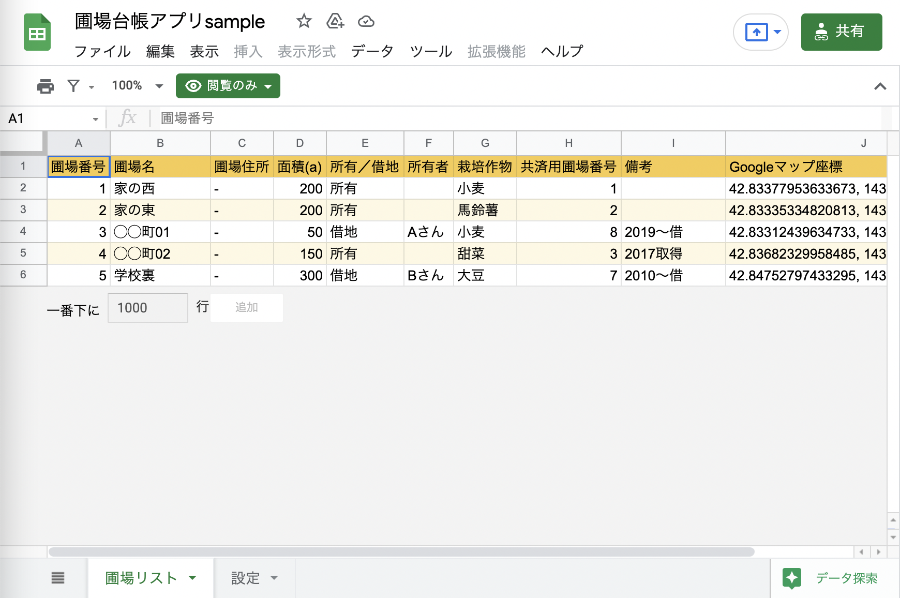

本シリーズは、**ノーコード開発ツール「Glide」** を使ってはじめてのアプリ制作をしていくシリーズです。

前回の記事で、これから制作していきたい農場のマップを表示する「圃場台帳アプリ」の概要を、現場での課題感も交えながら紹介しました。

今回は、**Glideでアプリ制作をするために必要なデータをスプレッドシートで準備**していきたいと思います。  

・・・といっても、どんなデータを用意したら良いのか、最初は難しいですよね。

このブログではまずはGlideでサクッとアプリ制作ができることを体感していただきたいので、僕の方でサンプルデータの入ったスプレッドシートを用意しました。  

本記事ではこのサンプルデータを眺めてみて、Glideアプリ制作にどんなデータが必要なのかをご紹介したいなと思います。

それでは、見ていきましょう！



## サンプルデータを眺めてみる

さっそく、サンプルデータを眺めてみましょう。  
これは今回制作する「圃場管理アプリ」に必要な情報がまとまったデータベースにあたります。  

まずは[こちらのリンク](https://docs.google.com/spreadsheets/d/1C9FJe1HflN4jUFQ-Zo69KphSSxlzpmzQyZwayMEeUc8/edit?usp=sharing)を開いてみてください。  

リンクを開くと、ブラウザにはこのようなスプレッドシートが表示されるかと思います。

スプレッドシートには、「圃場リスト」シートと「設定」シートの２つのシートが用意されています。  

このように、**アプリ化したい情報の入ったデータベースを用意することがGlideでアプリ制作をするためには重要**となります。  

逆にいうと、日常使っている業務データなどからこのようなデータベースを作って用意しておけば、カンタンにアプリ化できてしまう、とも言えますね。

具体的に中身を見ていきながら、データベースに必要なポイントを見ていきましょう。

## アプリ制作にはテーブル形式のデータが必要

まず、「圃場リスト」シートのデータを見てみましょう。  

このシートにはマップとして表示させたい田畑の情報がまとまって入っており、今回のアプリの一番重要な部分になります。 

 

全体を眺めていただくと、データは表の形で綺麗に整理されていることがわかるかと思います。  

表形式のデータにはしっかりとルールがあり、「１行＝圃場１つの情報」「１列＝それぞれの圃場に関する同種類の情報」として配置されています。  
このようなデータの形式のことを「テーブル」と呼ぶのでした（[参考](https://nouka-it.com/blog/2022/spreadsheet-intro03/)）。  

まずはこのように、**Glideでアプリを制作するためには、スプレッドシートでテーブル形式のデータを用意しておく必要がある** ということを、覚えておいてくださいね。

## 圃場リストに必要な情報を確認する

改めて、「圃場リスト」シートのデータを具体的に見ていきます。

A列〜I列には、「圃場番号」や「圃場名」「面積」など、圃場台帳を作るにあたってそれぞれの田畑について必要な情報を入れるようにしています。  
必要な項目があれば列を追加したり、不要な列は削除したりして構いません。

J列に、「Googleマップ座標」という列があり、何やら数字の羅列が入っているかと思います。  
これが今回のアプリのポイントです。マップ上に田畑の場所をピンで表示するために必要な座標になります。

この座標の調べ方はこちらの記事にまとめていますので、ぜひ自身の農場マップを作成する時には活用してみてください。

## １つのシートから１画面ができあがるでデータを用意しよう

次に、「設定」シートを見てみましょう。  

このシートには農場や圃場台帳に関する情報がまとまっています。  

もちろん、このシートもデータはテーブル形式で整理されていますね。

**Glideアプリでは、スプレッドシートの各シートから１つの画面ができあがる**、というようなイメージで考えていただくと、データの用意がしやすいかなと思います。

ところで、何やらメニューバーの下に「閲覧のみ」という緑色のマークが表示されているのに気付きませんでしたか？

実はこのままだと、皆さんの手元でこのスプレッドシートを編集したり、アプリ制作を始めることができません。

これは僕の方で制作したスプレッドシートを「共有」機能を使って閲覧権限のみを皆さんと共有しているためです

みなさんが手元でこのスプレッドシートを扱えるようにするために、自身のGoogleドライブへのコピーを作成しておく必要があります。

## まとめ

さて、今回はGlideアプリを制作するために必要なデータを、サンプルデータを元に見てきました。

