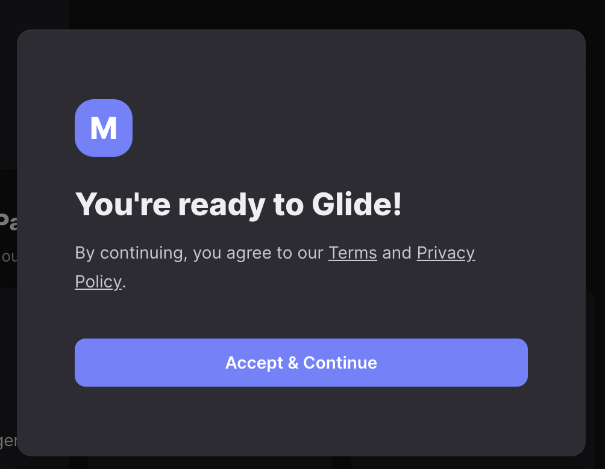

本シリーズは、**ノーコード開発ツール「Glide」** を使ってはじめてのアプリ制作をしていくシリーズです。


[■「はじめてのGlide」一連の記事はコチラ](https://nouka-it.com/categories/%E3%81%AF%E3%81%98%E3%82%81%E3%81%A6%E3%81%AEglide/)


前回の記事では、サンプルデータを眺めながら、Glideによるアプリ制作にどのようなデータが必要なのかを確認してみました。

<div class="iframely-embed"><div class="iframely-responsive" style="height: 140px; padding-bottom: 0;"><a href="https://nouka-it.com/blog/2022/field-ledger-glideapp03/" data-iframely-url="//cdn.iframe.ly/api/iframe?card=small&url=https%3A%2F%2Fnouka-it.com%2Fblog%2F2022%2Ffield-ledger-glideapp03%2F&key=d9cf522df2f6cbab308f945a2b3c5555"></a></div></div><script async src="//cdn.iframe.ly/embed.js" charset="utf-8"></script>


今回からは、 いよいよお待ちかね（？）の、**Glideでのノーコードアプリ制作のはじめ方** を見ていきたいと思います。

まずは、Glideでアカウントを作成していきましょう！




## スプレッドシートからアプリを作れる「Glide」

「Glide」は、プログラミング不要でアプリが作れる「ノーコード開発ツール」の一つです。  

ノーコード開発ツールにもいろいろありますが、Glideはその中でも特に直感的でカンタンにアプリを制作することができるのが特徴です。  

Googleスプレッドシートに用意したデータをもとにサクッとWebで動くアプリを作ることができます。

また、作成したWebアプリをスマホアプリのように

これにはPWA（Progressive Web Apps）という仕組みを利用しています

基本的には無料で使えますが、データ数が多くなったり機能を増やしたい場合は有料プランがあります。

無料プランと有料プランの違いについては、こちらでまとめてくれています。

https://hikari-sedori.com/glide-free/

お試しで使いたい場合や、チーム内で少ないデータ量を使う場合などは、無料プランで十分活用できると思いますので、まずは無料で試してみましょう。


```
無料プランの制限として「アドレスピンは、10個以上はできません。」とありますが、座標を使うことで無料プランでもこの上限を超えて利用できるようです。（2022年3月現在）
今回の「圃場台帳アプリ」ではこの機能を活用して実現しています。
```


[Glide – Create apps & websites without code.](https://www.glideapps.com/)

また、Glide自体は英語なので、慣れるまで少し大変かもしれませんが、直感的に操作できるので怖がらず使ってみましょう。


## Glideでアカウントを作成する

それでは早速、Glideのアカウント登録から始めていきましょう。  


こちらを開きます。


[Glide – Create apps & websites without code.](https://www.glideapps.com/)

GlideのWebページが開きました。


これからアカウントを作成していきます。  

右上の[Sign Up]をクリックしましょう。  


するとこんなウィンドウが真ん中に現れるかと思います。


Googleアカウントを使ってアカウントを作成するか、Emailアドレスを使うかを選びます。


ここではGoogleアカウントと紐付けてアカウントを作成していきたいので、上の**「Sign up with Google]**を選びましょう。


すると次に、「ログイン - Googleアカウント」というウィンドウが出てきます。  

ここでアカウントの選択を行いますので、自身のアカウントを選び、パスワードを入力してログインしてください。


こんなリクエストが出てくるので、右下の[許可]をクリックします


Googleアカウントとの紐付けができると、画面が変わります。  


これで、サインインが完了しました。


引き続き、真ん中に出ているウィンドウにアカウントの初期設定の入力をしていきます。


## Glideアカウントの初期設定

さて、このようなウィンドウが真ん中に出ていますね。

入力・選択を行い、[Continue]をクリックします。


- First NameとLast Name
  - Googleアカウントに入力している苗字と名前が自動で入っているはずです
- How will you use Glide?
  - クリックして出てくる中から選択。なんでも良い
- how did you hear about Glide?
  -  こちらもなんでも良いので選択。


次に出てくる画面もそれぞれ、必要に応じて入力・選択して[Continue]を選択します。


次に出てくる「Add team members」は自分一人でアプリを作る場合には必要ないので、そのまま一番下の[Skip]をクリック。


最後に、[Accept & Continue]をクリックします。


以上で、初期設定が完了です！





## まとめ

Glideアプリのサインインが完了しました。

次回は、スプレッドシートを元にGlideアプリ制作を始めていきましょう！
