本シリーズは、**ノーコード開発ツール「Glide」** を使ってはじめてのアプリ制作をしていくシリーズです。  
農場のマップを表示する「圃場台帳アプリ」を題材に、スプレッドシートでのデータの持ち方やアプリの作り方を学んでいきます。

[■「はじめてのGlide」一連の記事はコチラ](https://nouka-it.com/categories/%E3%81%AF%E3%81%98%E3%82%81%E3%81%A6%E3%81%AEglide/)

前回の記事では、アプリ制作にどのようなデータが必要なのかを、サンプルデータを眺めながら確認してきました。

今回からはいよいよお待ちかね、Glideでのノーコードアプリ制作をはじめていきたいと思います！

まずは手始めに、**アカウント作成のやり方** を見ていきましょう。



## Glideでアカウントを作成する

それでは早速はじめていきましょう。  
まずはこちらのリンクから、Glideの公式Webページを開いてみてください。

[Glide – Create apps & websites without code.](https://www.glideapps.com/)

ブラウザにこのようなページが表示されます。

 ここからアカウントを作成していきます。  
 右上の **[Sign Up]** をクリックしましょう。 

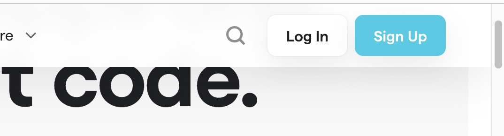

すると、こんなウィンドウが真ん中に現れるかと思います。

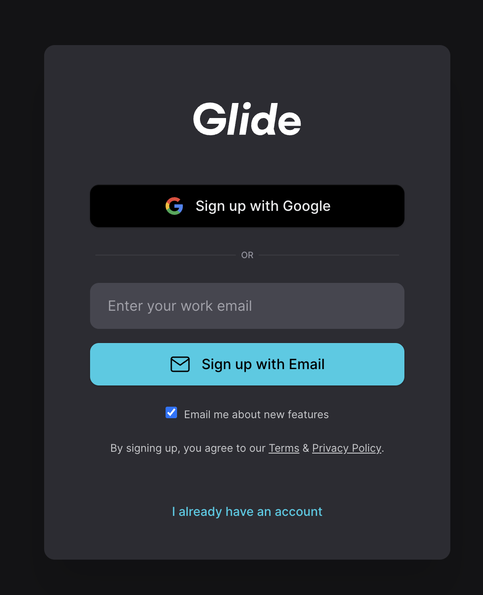

ここでは、Googleアカウントを使ってアカウントを作成するか、Emailアドレスとパスワードを使ってアカウントを作成するかを選ぶことができます。

どちらでも良いのですが、個人的にはパスワード管理などは **Googleアカウントと紐付けてアカウントを作成する方がラク** かなと思います。  

なのでここは、上の **[Sign up with Google]** を選んでやっていきましょう。

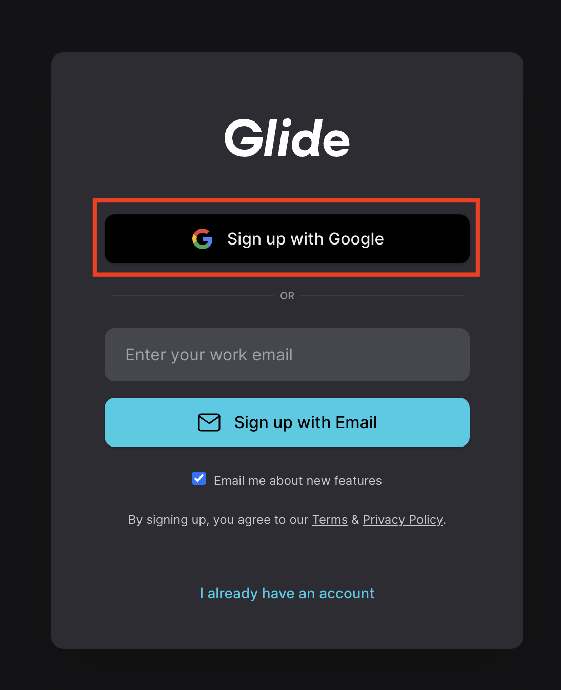

すると次に、Googleアカウントにログインするためのウィンドウが出てきます。  

自身のGoogleアカウントを選択し、パスワードを入力してログインしましょう。

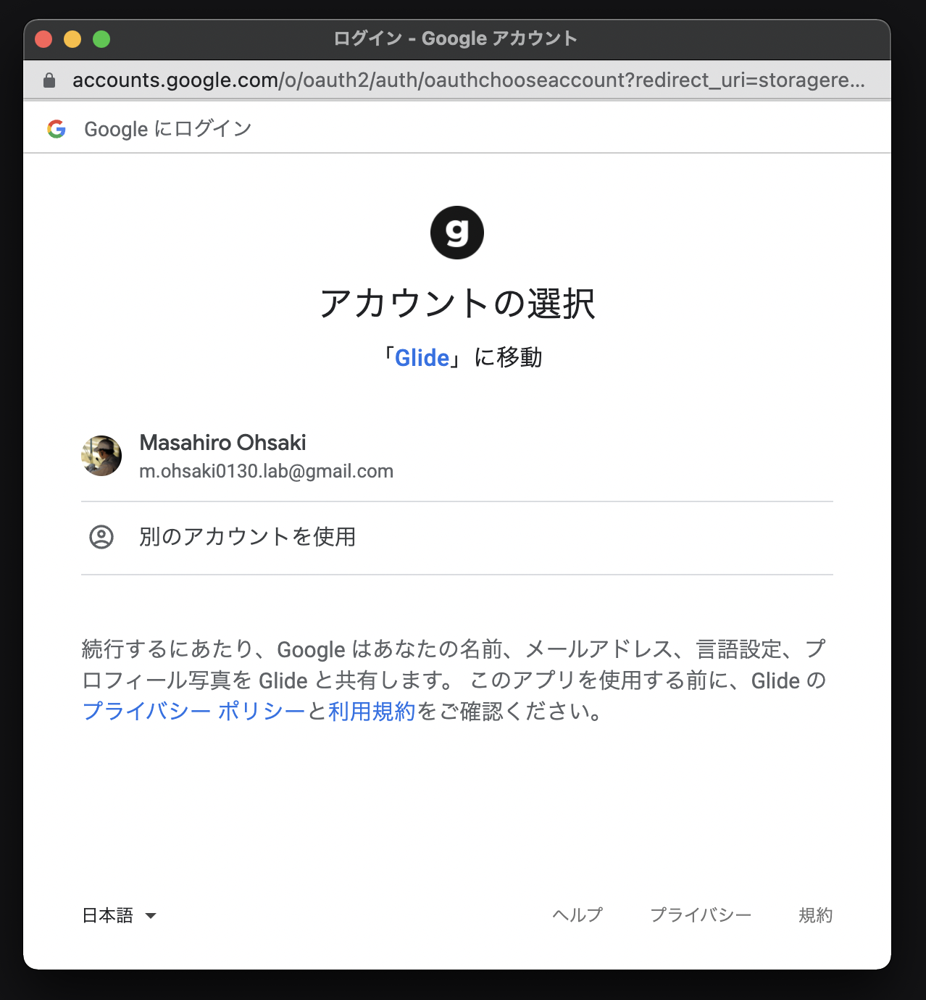

こんなリクエストが出てくるので、右下の **[許可]** をクリック。

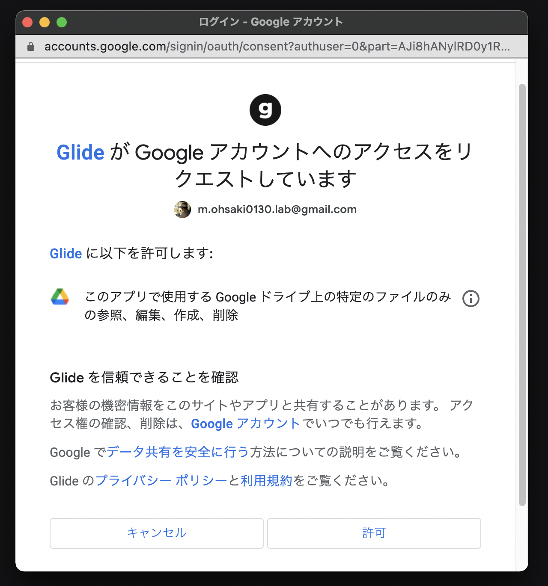

すると、このような画面に変わりました。 

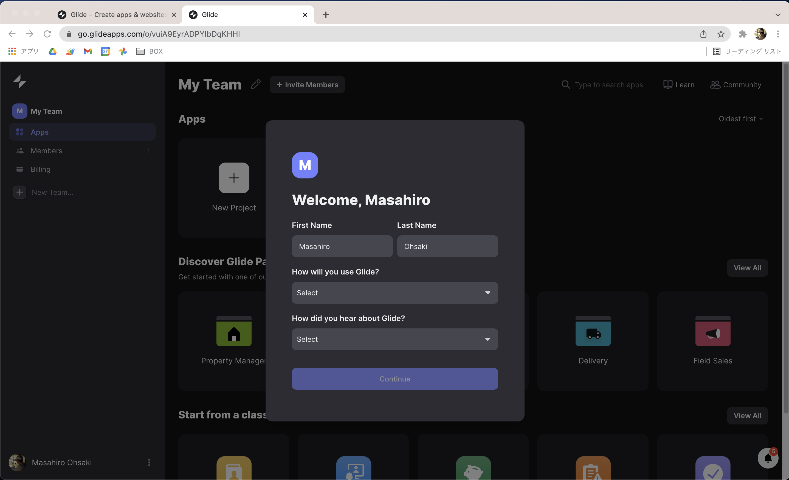

これでひとまず、Glideアカウントの登録が完了しました！  
今後は、GoogleアカウントでGlideにログインすることができるようになります。

それでは早速、アプリ制作を始めていきたいのですが……。  
まだもうちょっと準備が必要です。 

## Glideアカウントの初期設定

引き続き、Glideアカウントの初期設定の入力をしていきましょう。  
真ん中に出ているウィンドウをご覧ください。

下記のような「Wellcome, 〜〜」という画面が出ているかと思います。  
画像を参考に入力・選択を行い、 **[Continue]** をクリックします。  

（全て英語なので不安かもしれませんが、アプリ制作には影響がない情報となりますので、気楽に入力して大丈夫ですよ！）

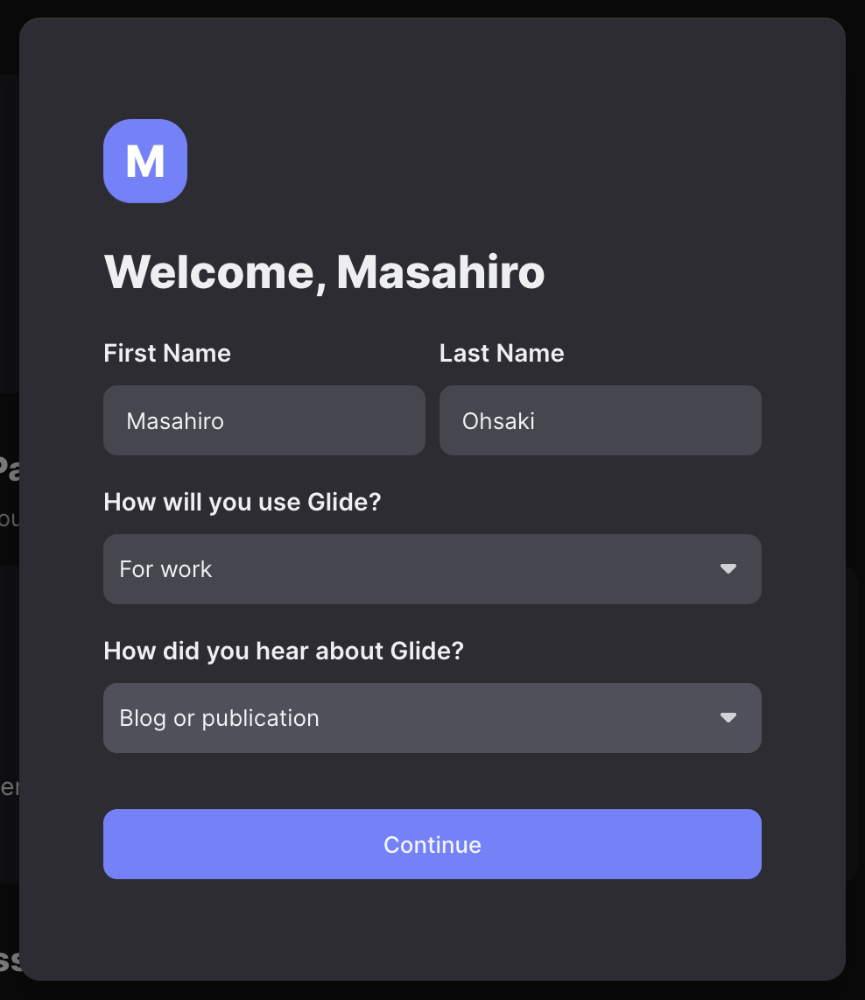

それぞれ、このようなことを聞かれています。

- **First NameとLast Name**
  - 自身の苗字と名前を入力します。
  - Googleアカウントに入力している苗字と名前が自動で入っているはずです。
- **How will you use Glide?**
  - Glideを使う目的についてプルダウンから選択します。
  - 「For fun（遊びで利用）」「For school（学校で利用）」「For work（仕事で利用）」など、目的に応じて選択しましょう。
- **how did you hear about Glide?**
  -  Glideを何で知ったかをプルダウンから選択します。
  - なんでも良いですが、ここでは「Blog or publication（ブログや出版物）」を選択します。

次に出てくる画面もそれぞれ、必要に応じて入力・選択して **[Continue]** を選択します。

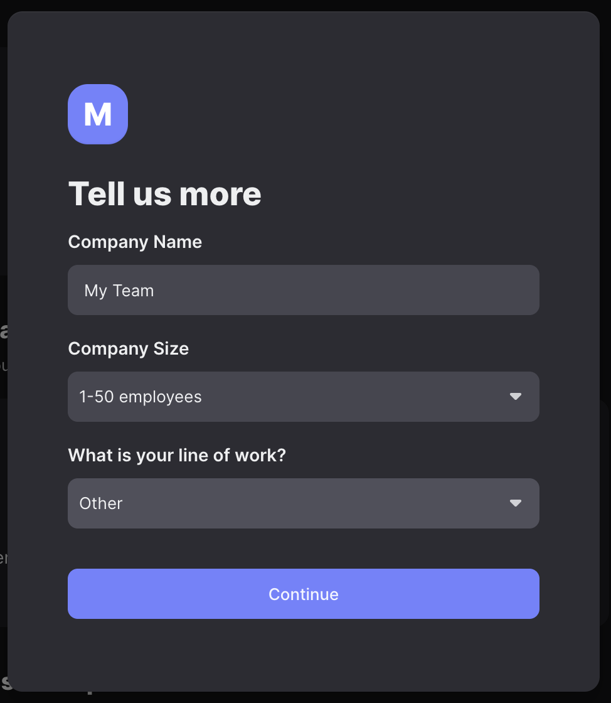

こちらもそれぞれ、このようなことを聞かれています。

- **Company Name**
  - 会社名を入力します。デフォルトのままで大丈夫です。
- **Company Size**
  - 会社の規模をプルダウンから選択します。
  - 従業員の人数に応じて選択するか、「not using it for work（仕事以外の用途）」を選びましょう。
- **What is your line of work?**
  - 自身の職業をプルダウンから選択します。
  - どれにも当てはまらなそうな場合は「Other」にしておきます。

次に出てくる「Add team members」は、複数人でアプリ制作ができるようにメンバーを追加するための機能です。  
自分一人でアプリを作る場合には必要ありません。そのまま一番下の **[Skip]** をクリックしましょう。

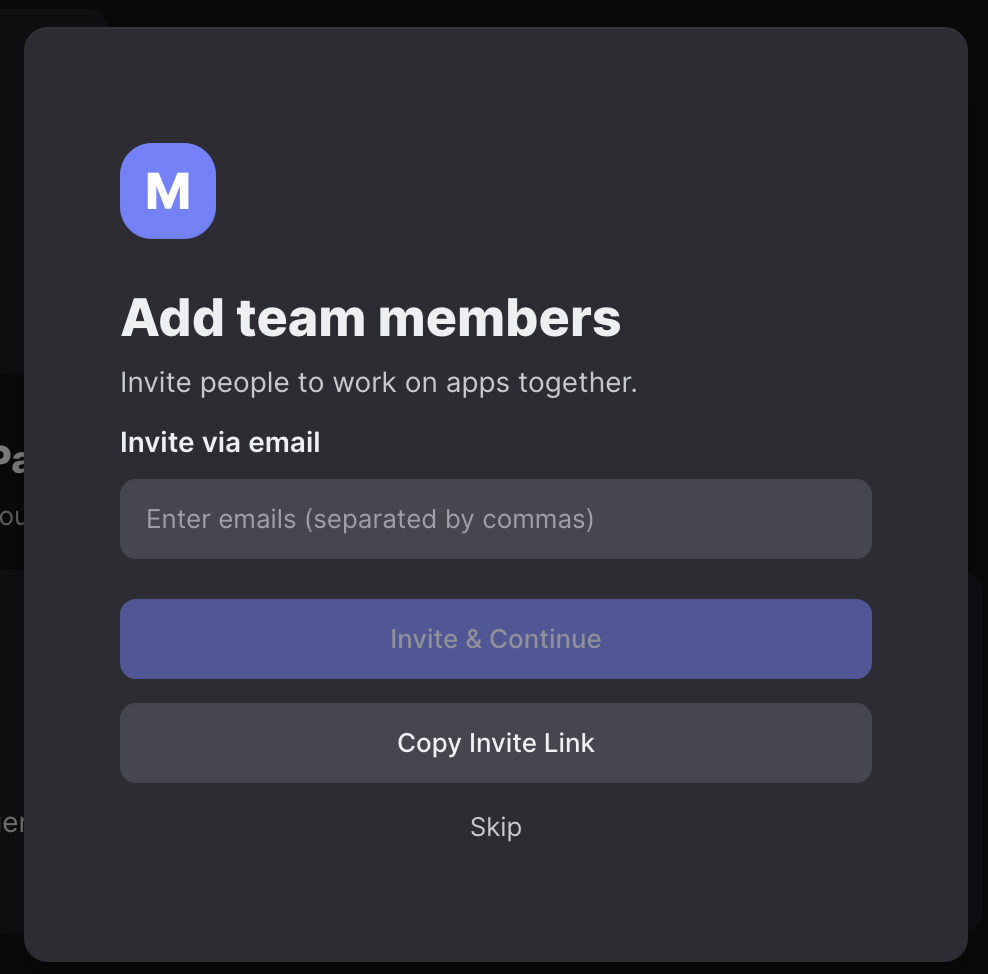

最後に、 **[Accept & Continue]** をクリックします。

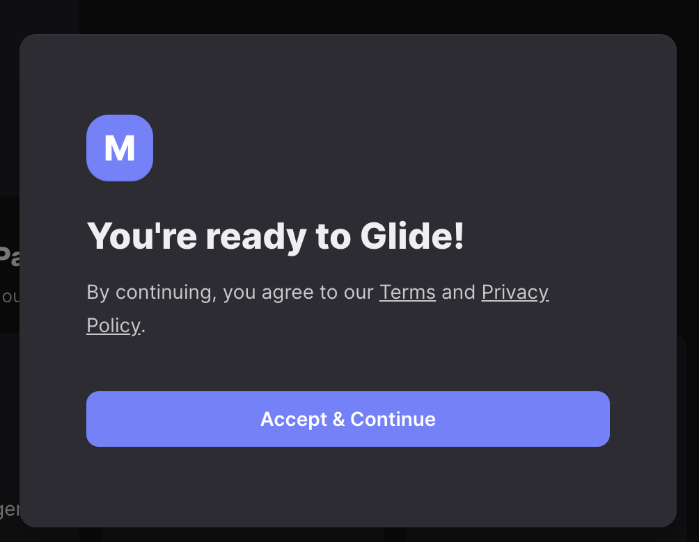

以下のような画面になればOKです！

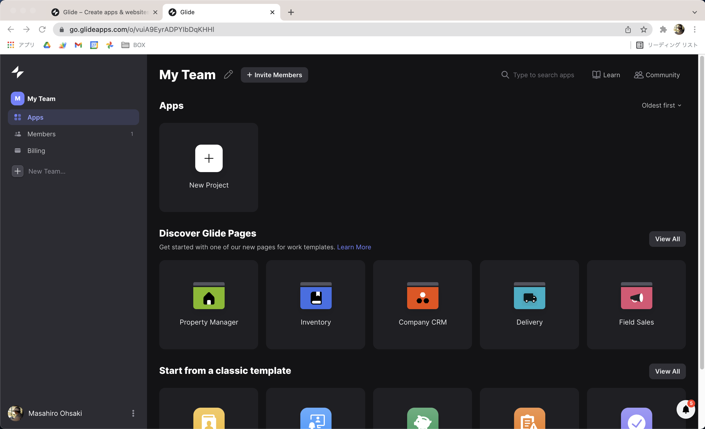

## まとめ

以上で、Glideのアカウント作成から初期設定までが完了しました。

次回はデータの入ったスプレッドシートを元に、アプリ制作を始めていきたいと思います！
