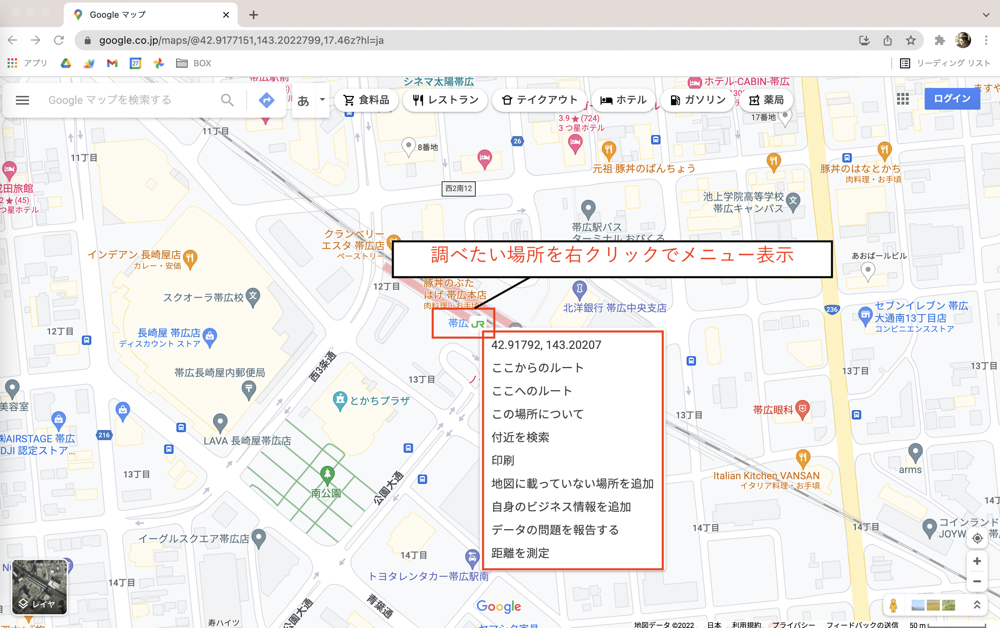
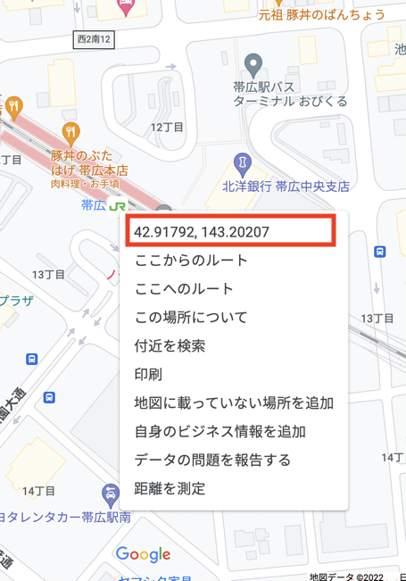
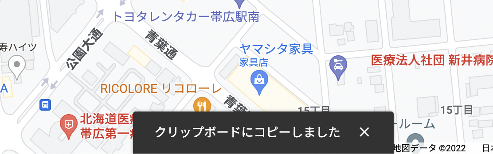
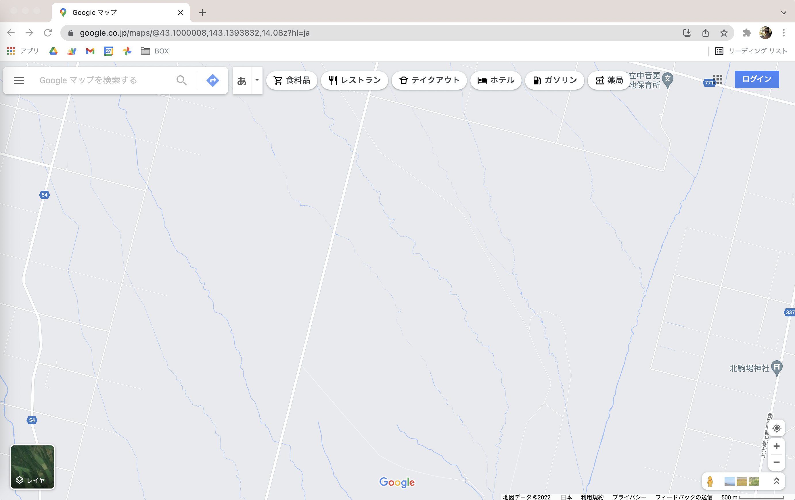
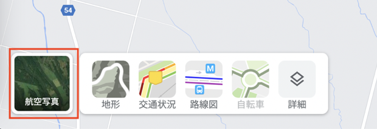

本記事では、パソコン版の[Googleマップ](https://www.google.co.jp/maps/?hl=ja)を使ってある１地点の座標（緯度と経度）を調べる方法を紹介します。

なかなか普段使う機会はないかもしれませんが、ノーコード開発ツール「Glide」で地図アプリを制作する場合に地点の座標をが必要になるので、その方法を簡単にまとめました。



## パソコン版Googleマップで座標を取得する

まずは、パソコンのWebブラウザで **Googleマップ** を開きましょう。

このようにマップが表示されます。

次に、座標を調べたい部分を拡大して、その地点を右クリックします。

ここでは「帯広駅」の座標を調べてみたいと思います。  
駅の場所を探して右クリックすると、このようにメニューが表示されますね。

メニューの一番上に、座標が表示されています。

帯広駅の座標は「北緯42.91792、東経143.20207」らしいです。

そのメニューの中の座標を **クリック** すれば、クリップボードにコピーすることができます。

そのままスプレッドシートなどにペーストすればOKです。  
とてもカンタンですね！

## マップの表示を衛星画像に切り替える

もし、畑の場所を調べたいときは、この白い地図の画面だと全く場所を特定することができません。

そういう時は、マップの表示方法を **「衛星画像」** に切り替えましょう。

**左下の「レイヤ」と書かれている四角の部分** にカーソルを合わせると、色々な表示方法のメニューがでてきます。

そのまま同じ場所をクリックすると、画面の表示を航空写真に切り替えることができます。

これなら、畑の位置を特定することができそうですね。

## まとめ

今回は、パソコン版のGoogleマップを使って、地点の座標（緯度と経度）を調べる方法をまとめてきました。

今回はGlideでマップを表示するために座標が必要になりましたが、他にも何か地図の座標とからめたアプリを作る際に、役に立つかもしれませんね。