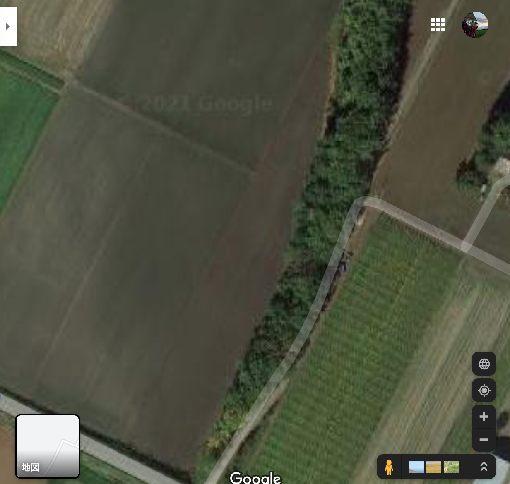
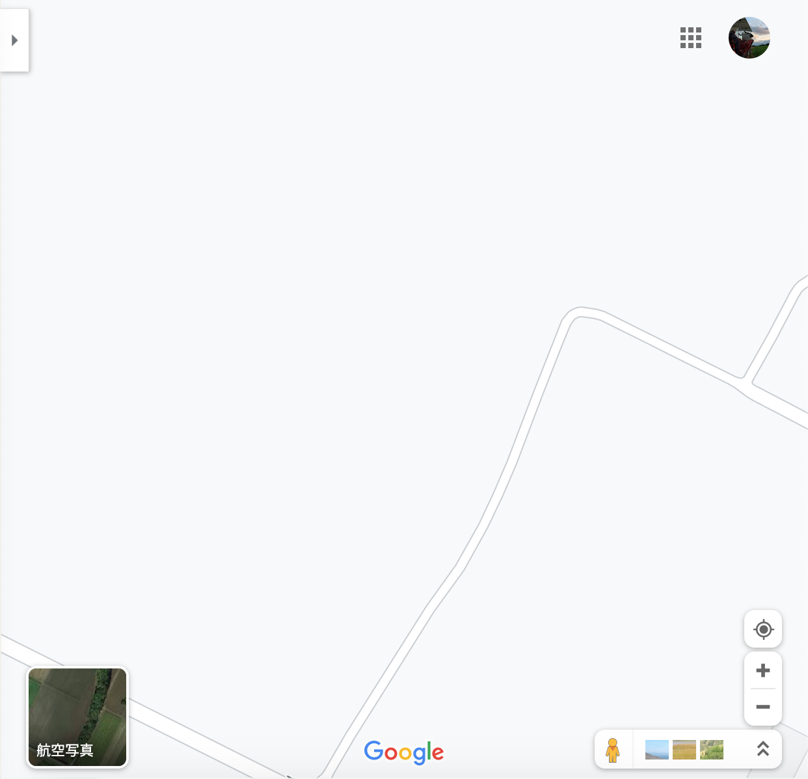
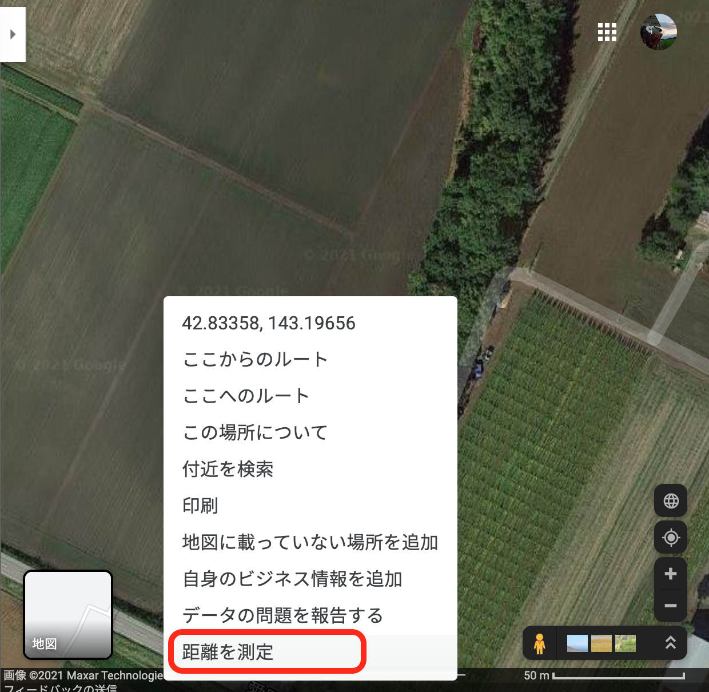
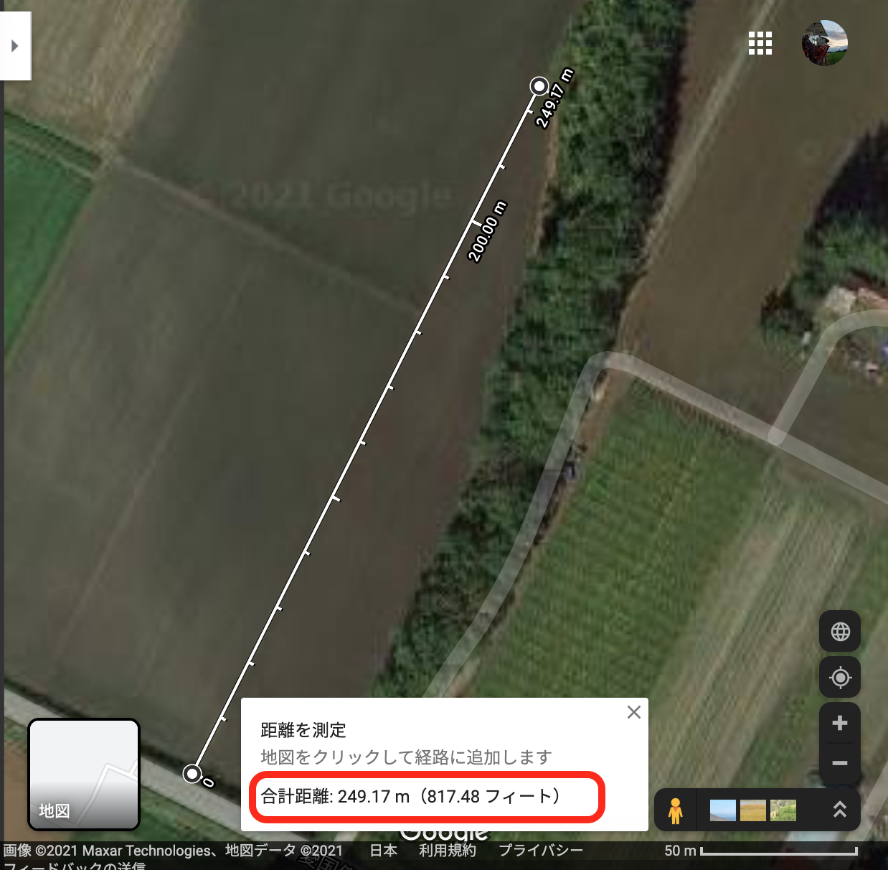
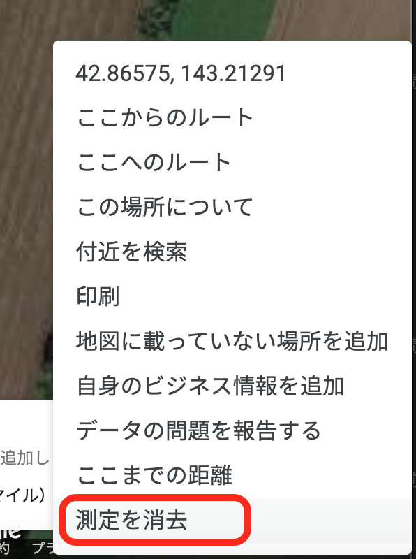
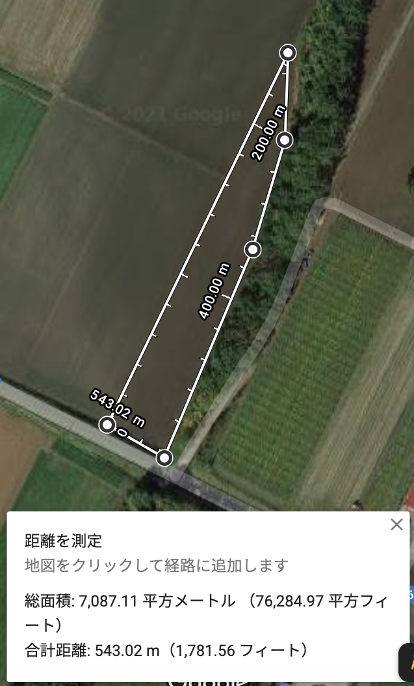

## はじめに

**[Google Map](https://www.google.co.jp/maps?hl=ja)** を使って、距離や面積を測ることができるのはご存知でしょうか？

この距離測定の機能を使うと、例えば **「新しく借りることになった圃場の長さは？」「圃場を途中で割っていくつかの作物をまく場合にどのくらいの面積になるの？」** などというような場合にとても便利なんです。

マップの表示を「航空写真」にすると、このように圃場の境界もしっかり判別することができます。

本記事ではこの **Google Mapの距離測定機能** を使って、三角形の形をした圃場の距離と面積を実際に計算してみます。

## （参考）Google Mapのパソコン版とスマホ版の違い

Google Mapをパソコンとスマホで使う場合で、距離測定機能でできることがやや異なっているので、ご注意ください。


・パソコン版（Windows, Mac） → 距離と面積を測定できる 
・スマホ版（Android, iPhone） → 距離の測定のみ


いずれにしても距離の測定は可能です。  
本記事ではパソコン版を使って、距離と面積の測定を実践していきます。

## 距離を測定する

まずは、２地点間の距離を測定してみます。

パソコン版の[Google Map](https://www.google.co.jp/maps/?hl=ja)を開き、測定したい圃場の場所を住所検索などで探しておきます。

次に左下の **[航空写真]** と書かれているところをクリックして、マップの表示を衛星画像に変更します。

するとこのように、圃場の境界線がわかりやすくなりました。

今回は、この衛星画像の真ん中らへんにある、縦長の三角形の畑を測定していきたいと思います。

拡大するとより境界をはっきり見ることができます。**右下の＋マークをクリックするか、マウスホイールでズーム**することができます。

それでは、実際に距離を測定していきましょう。

測定したい場所の **始点で右クリック** し、出てくるメニューから **[距離を測定]** を選びます。

次に **終点で左クリック** すると、画面下部にその直線の距離が表示されます。

この畑の境界線の距離は、約250mのようですね。


もし点を打つ位置を間違えた場合は、以下の操作で点を修正・削除できます。 
・点をドラッグして移動 
・点を左クリックして削除 


**距離測定を終了する場合**は、右クリックして出てくるメニューで **[測定を消去]** をクリックすればOKです。

## 面積を測定する

次に、２地点の距離だけでなく **外周の長さと面積** を測定してみましょう。

先ほどの直線に続けて左クリックで点を取っていくことで、圃場の外周を折れ線のように繋げていくことができます。  
最後に始点の場所をもう一度クリックすると、畑の範囲を囲むことができます。

下のウィンドウに、総面積と合計距離が出てきていますね。
この圃場の総面積は「約7000㎡ ＝ 約0.7ha」というのが簡易的に分かりました。

## おわりに

パソコン版のGoogle Mapを使って、圃場の長さと面積を簡単に調べることができました。

とても簡単で便利なので、ぜひ試してみてくださいね！