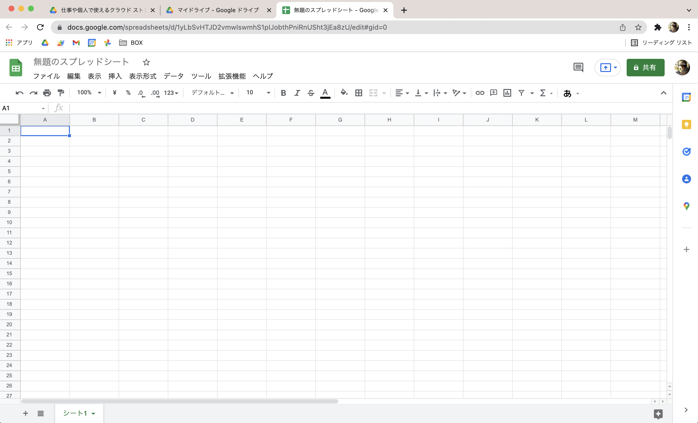

今回の記事では、業務データの整理に便利な **「Googleスプレッドシート」** の特徴について、これから始める方向けに解説していきます。

読者の中には、同じ「表計算ソフト」のジャンルにある「Microsoftのエクセル」を活用している方も多いのではないかな、と思います。

なのでエクセルとの比較も交えながら、メリットやデメリットなどを紹介していきたいと思います！



## Googleスプレッドシートとは

スプレッドシートとは一言で言うと、 **Google社が提供している「表計算ソフト（アプリ）」** のことです。  
  
*⬇︎公式ページ*  
[オンラインでスプレッドシートを作成、編集できる無料サービス](https://www.google.com/intl/ja_jp/sheets/about/)

表計算ソフトというと、Microsoftのエクセルのようなズラーっとマス目が並んだ画面をまず思い浮かべるかと思います。  

スプレッドシートもその仲間なので、ひとまずは「エクセルとだいたい同じような画面で同じような仕事ができる」とイメージしておいてください。

ただここで、スプレッドシートには大きな特徴があります。  

それは **「インターネットを使って全ての機能を活用できる」** ということです。

これにより、専用のアプリをインストールする必要がなく、Webブラウザ上で動かすことになります。  
なのでWindowsやMacなど、どのOSを使っていてもすぐに使い始めることができます。

また、このスプレッドシートはGoogleドライブ同様、無料で活用できちゃうのも魅力的なポイントです。

## 表計算ソフトの役割とできること

ところで、そもそも「表計算ソフト」を使うとどんなことができるのでしょうか？

一度ここで、改めてその役割を確認しておきましょう

表計算ソフトとは **「数値データの集計・分析に用いられるアプリケーションソフトウェア」** のことです。  
（引用：[Wikipedia](https://ja.wikipedia.org/wiki/%E8%A1%A8%E8%A8%88%E7%AE%97%E3%82%BD%E3%83%95%E3%83%88)）

めんどくさい複雑な計算や集計などを自動で行ってくれたり、数値データに限らず綺麗にレイアウトした見やすい表を作ったり、グラフやカテゴリごとの集計表を作成して分析することができる・・・などなど、使いこなせるようになるととても便利なツールです。

・・・というのが本来の表計算ソフトの役割なのですが、このブログでは複雑な計算をしたりグラフを作ったり、という使い方については、基本的にはあまり触れません。

それよりも、 **身の回りのデータを管理できる「簡易的なデータベース」** として表を使っていく、という活用がメインになってきます。

>  **【NOTE】**   
> データベースという用語についての詳細は省きますが、ここでは **「パソコンが扱いやすいデジタルデータの形で身の回りの情報を整理して、いつでも追加したり取り出しやすくできるもの」** くらいのイメージで捉えておけばバッチリです。

## スプレッドシートのメリットとデメリット

話をスプレッドシートに戻しますね。  

先ほど、「スプレッドシートもエクセルも同じような仕事ができる表計算ソフトである」というお話をしました。

ですが、できることは同じでもそれぞれ違った特徴があります。  
エクセルもスプレッドシートも、どちらも得意・不得意な分野があるのですね。

大きな違いとして「スプレッドシートはインターネットを使って全ての機能を活用できる」という特徴を先ほどご紹介しました。

これによるメリットとしては、   
- **複数端末で利用できる**  
- **複数人での共有・共同編集も簡単にできる**  
- **他のGoogleサービスやアプリとの連携がやりやすい**

というようなことが挙げられます。

・・・なんだか、[こちらの記事](https://nouka-it.com/blog/2022/01/drive-intro/)で見たドライブの利点と似ていると思いませんか？

それもそのはず、作成したファイルは自身のドライブの中に保存されるため、ドライブの利点がそのままスプレッドシートの利点にもなるのです。

一方で、スプレッドシートのデメリットもいくつかあります。

- **通信環境によりエクセルよりも操作が遅い場合がある**  
- **印刷の設定があまり細かくできない**

それぞれ使い込んでいくともっと色々と違いはあるので、用途によって使い分けるのがベストですね。

このブログの目的は、ITツールによる身の回りのデジタル化を進めることです。  
そのためには、 **インターネットを通じて他のアプリと連携しやすいスプレッドシートを使うのをオススメ** します。

## おわりに

さて、今回は一旦こんなところでしょうか。

これから始める方向けに、Googleスプレッドシートの特徴をカンタンに見てきました。

次回は、実際にスプレッドシートを作成してみたいと思います。