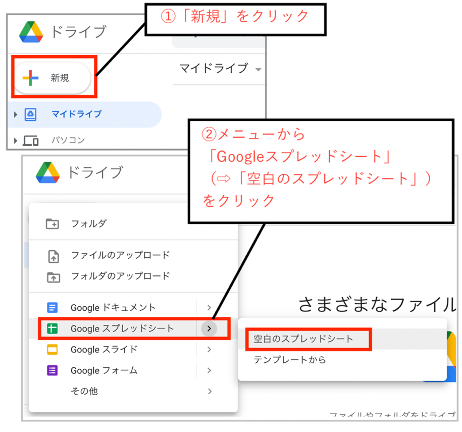
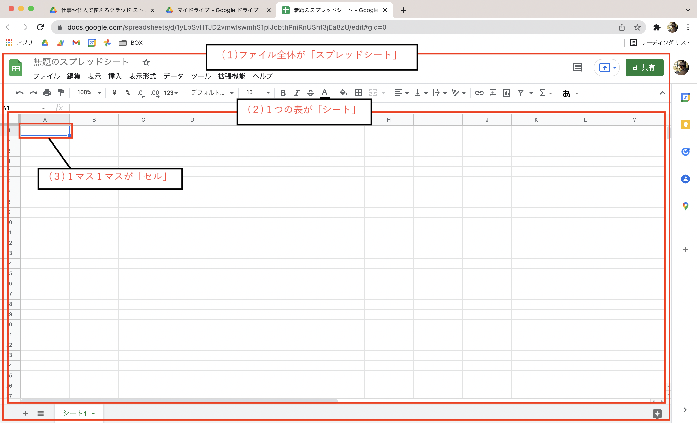
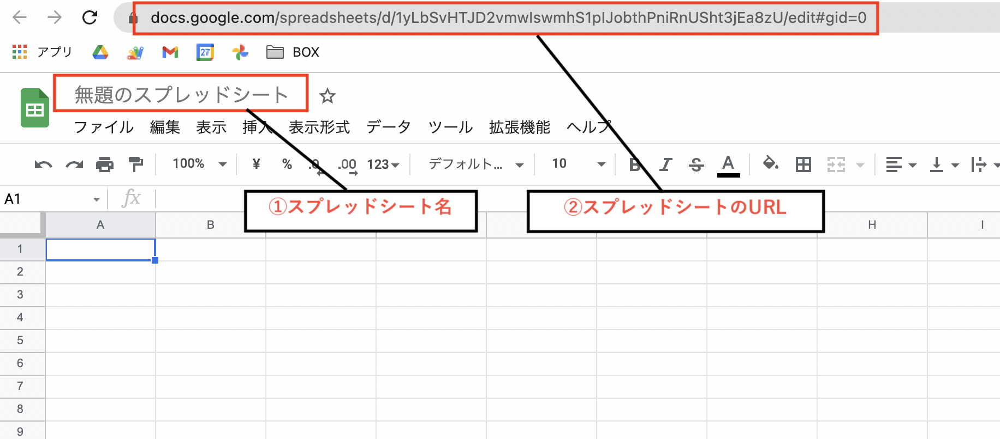
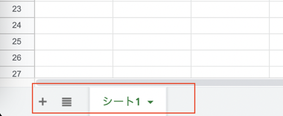
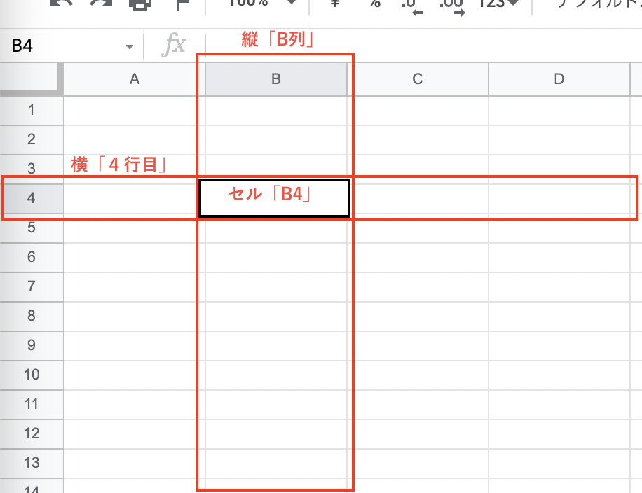

今回の記事では、アプリ制作のためのデータ管理に便利な **「Googleスプレッドシート」** の始め方と表計算ソフトの基本的な考え方について、初心者向けに解説していきます。

おそらく 「たまにエクセルを使うことがある」というような方にとっては、基本をおさらいしながら取り組める内容かな、と思います。  

一方で業務で既にエクセルをバリバリ使っているという方には、だいぶ物足りない内容だと思います。適度に飛ばしちゃってください。

Googleスプレッドシートってなに？どんなことができるの？と言う方は、前回記事を参考にしてみてくださいね。

それでは、見ていきましょう。



## スプレッドシートを始めるための準備

スプレッドシートを始めるには、事前準備としてGoogleアカウントが必要になります。  

また「Googleドライブ」の中にスプレッドシートを作成していくことになるので、これらアカウントやドライブの準備がまだの方は、こちらの記事を参考に用意しておいてくださいね。

## スプレッドシートを新規作成してみよう

今回はさわりだけになりますが、試しにスプレッドシートを新規作成してみたいと思います。

まずは、先ほど準備をしたドライブのマイページを、Webブラウザで開いている状態にしておいてください。

次にページの左上にある **「＋新規」** をクリックして、出てくるメニューの「Googleスプレッドシート」から「空白のスプレッドシート」を選択してみてみます。  
（「Googleスプレッドシート」をクリックするだけでも大丈夫です。）

するとブラウザに新しいタブが開かれて、このような表がズラーっと並んだ画面が出てきましたね。

これだけで、スプレッドシートの新規作成が完了です。

## 表計算ソフトで抑えておきたい３つの要素

ここで、スプレッドシートを扱う上で最低限知っておきたい要素を簡単に整理しておきますね。

大きく、次の３つの要素を抑えておくと良いでしょう。

**(１)スプレッドシート**  
**(２)シート**  
**(３)セル**  

表計算ソフトを使ったことのある方なら知っていると思うので、おさらいのつもりで見てみていただけたらと思います。

画面上で見ると、それぞれ以下の場所が対応しているイメージです。

### (１)スプレッドシート

まず「スプレッドシート」は一番大きなくくりで、 **このスプレッドシートのファイル全体** を指します。例えると、１冊のノートみたいなイメージです。

エクセルでいうと「ブック」「ワークブック」と呼ばれる、１つのエクセルファイルに当たります。

左上の「無題のスプレッドシート」と表示されているのがこのスプレッドシート名になり、この名前がそのままドライブに保存されるファイル名になります。

また、作成したスプレッドシートには自動でURLが割り振られていて、それによりブラウザ上での表示ができるようになっています。

### (２)シート

次に「シート」は、**スプレッドシートを構成する表形式の領域** のことです。  
スプレッドシートが１冊のノートと例えると、シートはその中身の各ページに対応するイメージでしょうか。  

エクセルでも同じく「シート」または「ワークシート」と呼ばれていますね。

基本的に僕たちが画面上で作業をするのは、このシート上での作業になります。  
シートは複数作成できるので、用途に分けてデータを管理することができます。

画面の左下に「シート1」と表示されているのが、シート名にあたります。 ＋マークからシートを増やすことが可能です。

### (３)セル

最後に、「セル」と呼ばれる部分は、シートの中の **縦と横の網目状に整列している１つ１つの領域** です。  
マス目入りのノートを想像していただくと、開いたページのマス目一つ一つがセルにあたるイメージでしょうか。

これはエクセルでも全く同じ呼び方をしていますね。

セルの位置は、縦の「列」と横の「行」が交差する番号で表されます。

列にはアルファベット、行には数字がそれぞれ割り振られていて、この組み合わせで１つのセルが特定できるようになっています。

住所の番地みたいなもので、例えばセル「B4」というと「B列4行目」にあるセルを表すことになります。

## まとめ

さて、今回はこのあたりまでになります。  

これから始める方向けに、Googleスプレッドシートの特徴と、表計算ソフトで押さえておきたい３つの要素について、簡単に見てきました。

次回は、実際にスプレッドシートへのデータ入力を試していきたいと思います。