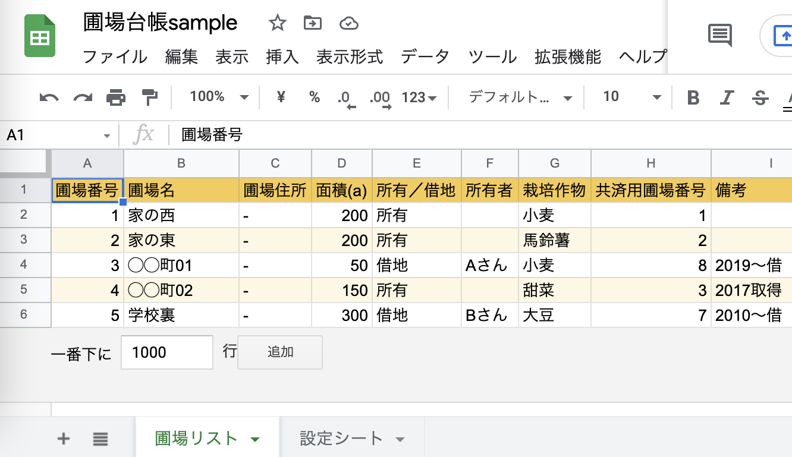
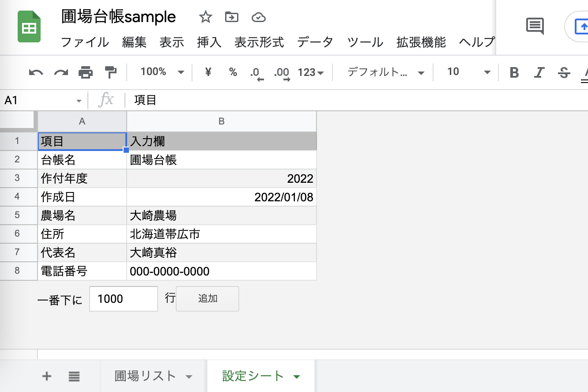
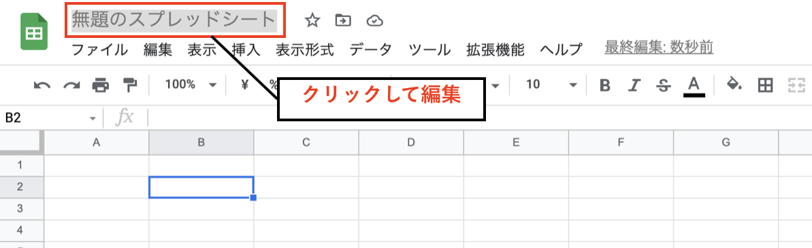
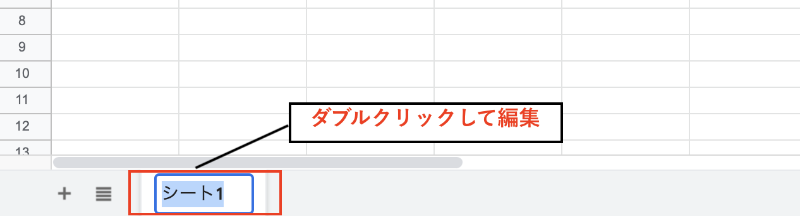
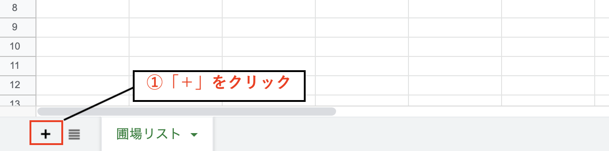
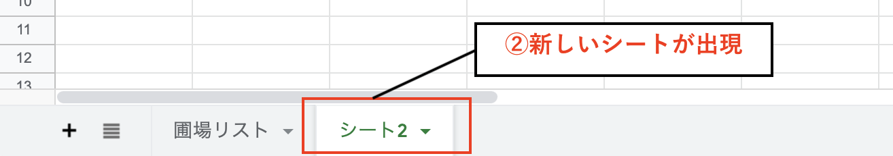
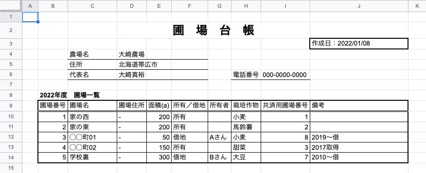
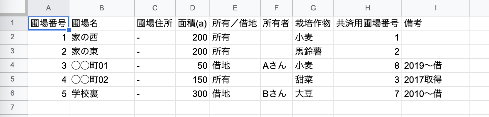

今回の記事では、Googleスプレッドシートに簡単な入力操作を行いながら、ITを使ってデータを管理する際の基本となる「データベース」「テーブル」といった考え方に触れていきたいと思います。

前回の記事でスプレッドシートの新規作成のやり方と表計算ソフトの基本的な考え方について触れていますので、そちらも合わせて参考にしてみてください。

それでは、見ていきましょう！



## スプレッドシートに入力するデータを決める

さっそく始めていきたいのですが、入力を始める前に**まずはスプレッドシートに「どんなデータをまとめておくのか」を決めておきましょう**。

例えば「取引先リスト」「商品リスト」「在庫台帳」「固定資産台帳」などなど、どんなものでも大丈夫です。  

皆さんが普段業務の中でよく活用するもので、特に毎日見るものだったり、一箇所にリストにしてまとめておくと便利そうなものを一つ、題材に選んでみましょう。

この記事では、農場の圃場（田畑）の情報をリストにした **「圃場台帳」** を作ってみたいと思います。  

以下が、今回作成するスプレッドシートの内容になります。  
１つのスプレッドシートに２枚のシートを作成していきます。  

**（シート１）「圃場リスト」に、圃場（田畑）の情報の一覧を記載する。**

**（シート２）「設定シート」に、圃場台帳に関する情報を入力する。**

では、順番に作っていきましょう。

## スプレッドシート名を変更する

まず最初に、スプレッドシート自体の名前を変更しておきます。

**画面の左上に「無題のスプレッドシート」と表示されている部分**があります。

そこをクリックするとスプレッドシート名を変更することができるので、内容に合わせて変更しておきましょう。

ここでは「圃場台帳sample」という名前をつけておきます。

## シート名の変更と追加をする

次に、データを用意する場所であるシートを準備しておきましょう。

今度は**左下の「シート１」と表示されているタブをダブルクリック**すると、シート名を編集できるようになります。  

ここでは「圃場リスト」という名前にしておきます。

次に、もう１つシートを用意するためにシートの追加を行います。

左下の「+」マークの上にカーソルを載せると、「シートを追加」というポップアップが出てきます。  

それをクリックすると新たに「シート2」という新しいシートが出現するはずです。

こちらのシートも先ほどと同様の方法で、名前を「設定シート」に変更しておきましょう。

## セルにデータを入力する

それではいよいよ、スプレッドシートに入力していきましょう。

先ほど作成した２つのシート「圃場リスト」「設定シート」それぞれに、サンプルデータの内容を参考に必要な情報を入力していってください。  

セルをクリックすると、そのセルに入力ができるようになります。

*⬇︎「圃場リスト」のサンプルデータ*

*⬇︎「設定シート」のサンプルデータ*

これで、一通りデータの入力は完了です。  

もしサンプルではなく自身でデータを用意したい場合は、いくつかポイントとなる基本ルールがあります。

***【データ入力の基本ルール】***
- **１行目には「見出し行」を用意する**  
- **２行目以降に「１行=１件」としてデータを追加していく**  
- **間に空行や空列は入れない**  
- **セルの結合を使わない**  
- **１シートには１つのテーブル（後述）のみ**  

これらのルールをしっかり守るようにしましょう。

・・・ルールが多くて、なんだか少し窮屈に感じるでしょうか？  
しかし、これにはちゃんとした理由があるのです。

## コンピュータが扱いやすいデータの形式とは？

もしかしたら皆さんの中には、わざわざシートを分けたりしないで「１枚にレイアウトされた台帳を作りたい」と考える方も多いかもしれません。  

*⬇︎こんな台帳を作りたい？*

このようにレイアウトされたデータは、「人」にとっては馴染みやすくて非常に見やすいデータ形式ですよね。  

一方で、先程の基本ルールに沿った整然と整理されているようなデータは、「コンピュータ」が扱いやすいデータの形式になります。

*⬇︎基本ルールに沿った整理されたデータ*

これは例えると、どこに何がしまってあるかがラベル付けして整理されている道具箱のようなものです。  
欲しい道具がどこにあるかは、ラベルを見れば一目瞭然ですよね。

このように、 **必要な時に情報を検索・活用しやすいように整理されたデータの集まりを、一般に「データベース」**  と呼びます。   

また、 **データを縦横に表の形式に配置したものを「テーブル」** と呼び、データベースにおけるデータ保管の基本の形となっています。

コンピュータが扱いやすいテーブル形式でデータを用意しておくことで、プログラミングやノーコードアプリ制作をしていく際に「作りやすさ」「メンテナンスのしやすさ」がぐんと変わってきます。

今はピンとこないかも知れませんが、今後IT活用がしやすくなってきますので、ぜひ抑えておいてくださいね。

## まとめ

今回は、「圃場台帳」を題材にスプレッドシートへのデータ入力を行ってみました。  

人が見るためのデータとコンピュータが扱いやすいデータの違いと、「データベース」や「テーブル」という重要な考え方についても触れてきました。

次回も引き続き初心者向けに、スプレッドシートの便利な機能を見ていきたいと思います。