前回は「圃場台帳」を題材にして、スプレッドシートによく活用するデータをまとめて、簡単な台帳を作るやり方をみてみました。

「データベース」「テーブル」といった、パソコン上でデータを用意する際の基本的な考え方についても整理しました。

今回はスプレッドシートの機能を利用して、作成した台帳の見た目を整えておくやり方を見ておきたいと思います。



## 前回のおさらい

前回の記事では、サンプルとして農場の田畑を管理するための「圃場台帳」をスプレッドシートで作成しました。  
その中には、「圃場リスト」と「設定シート」という２つのシートに分けてそれぞれに整列したデータを入力しました。

*⬇︎（１）「圃場リスト」*

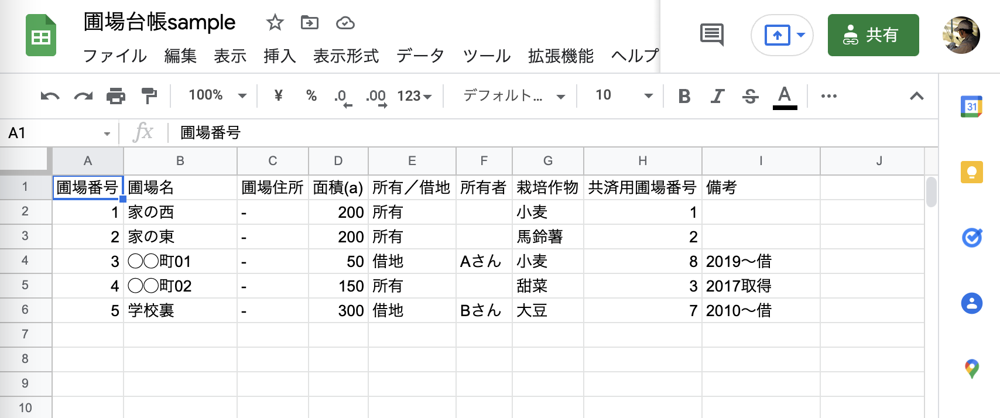

*⬇︎（２）「設定シート」*

このようにデータを表の形に配置した形を **「テーブル」** と呼び、コンピュータが活用しやすいデータ形式になるのでしたね。

そしてこのテーブルには以下のような基本ルールがあるのでした。

 

***【テーブルの基本ルール】***

- **１行目には「見出し行」を用意する**
- **２行目以降に「１行=１件」としてデータを追加していく**
- **間に空行や空列は入れない**
- **セルの結合を使わない**
- **１シートには１つのテーブルのみ**

 

皆さん自身の業務データを扱う際も、このようなテーブルの基本ルールを守っているかチェックしてみてくださいね。

## 今回やること

実は、この状態でデータとしては十分なので、台帳としては完成といえます。  

ただ、このままだと見た目が味気なくて使いづらそうと感じませんか？  

真っ白のままだと今後データ数が増えてくると、スプレッドシート上で編集をする際に行を間違えてしまったりしてしまう可能性があります。

そこで、以下のように表を見やすく整えておきたいと思います。

*⬇︎見やすく整えた「圃場リスト」*

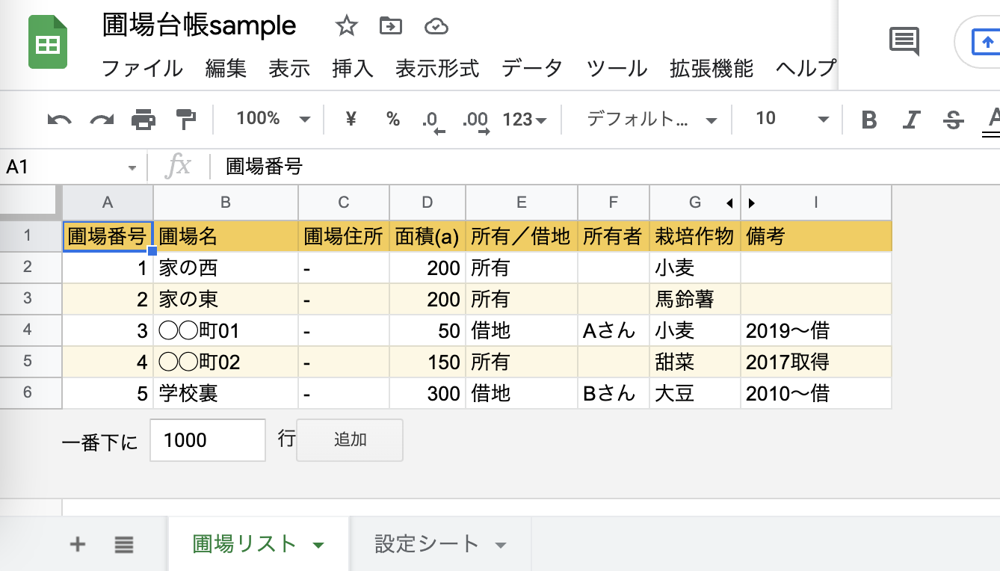

*⬇︎見やすく整えた「設定シート」*

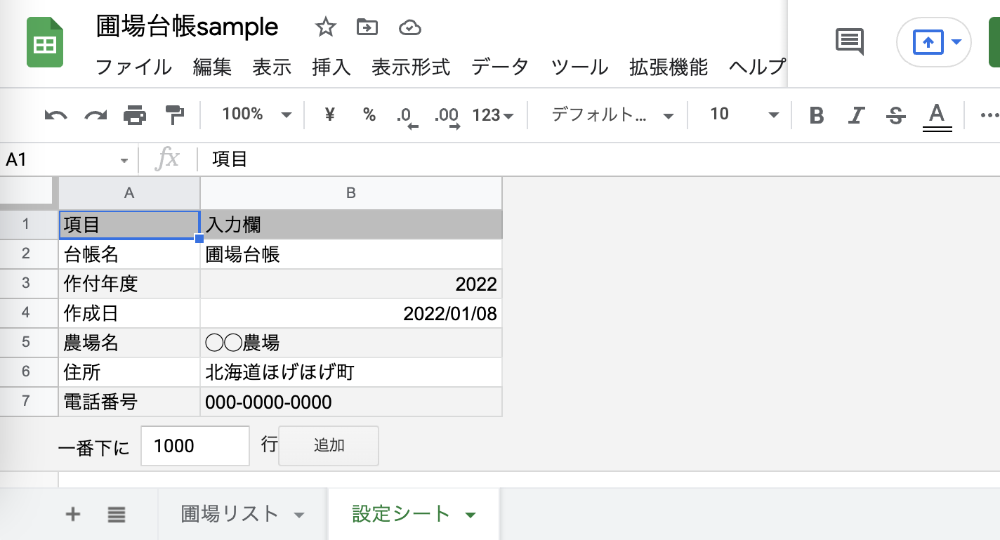

表の各行が色違いになって、綺麗に見やすくなりましたね。  
また、周囲の余計な空白セルも削除して、データが入っているテーブルの部分だけを残すようにしました。

具体的には、以下のようなことを行っています。

**(１)空白行・列の削除**  
**(２)交互の背景色の適用**

どちらもスプレッドシートの機能を使ってカンタンにできますので、そのやり方を見ていきましょう！

## (１)不要な空白行・列を削除する

最初に、表の外側にある不要な行・列の削除からやっておきましょう。  

まず、データが入っていない最初の行全体（ここでは7行目）を選択した状態にします。  
行全体を選択するには、シートの一番左の行番号をクリックします。  
（単一のセルではなく、行全体が青色に反転していればOKです。）

この状態で、**Macなら「Cmd + Shift + ↓」（Windowsなら「Ctrl + Shift + ↓」）** のキーを押してみましょう。  

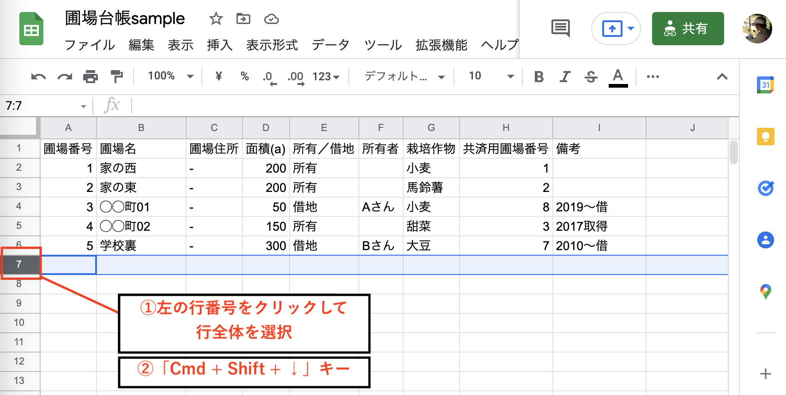

すると、シートの一番下の行まで一気に選択することができます。

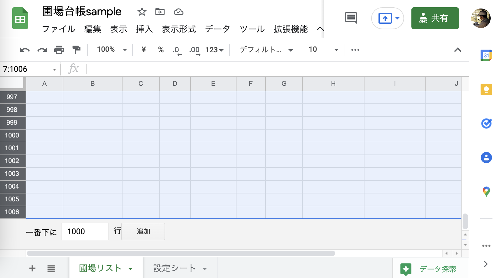

次に、反転している行かセルの上どこでも良いので、**右クリック**するとメニューが出てきます。そのメニューの中から **「行◯ - ◯を削除」** を選択しましょう。

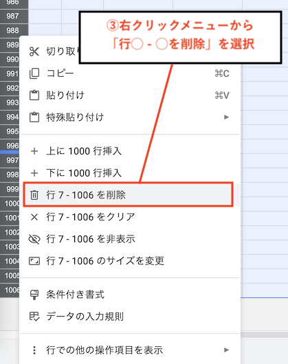

すると、このようにデータのある範囲の行だけを残して、不要な行を削除することができました。

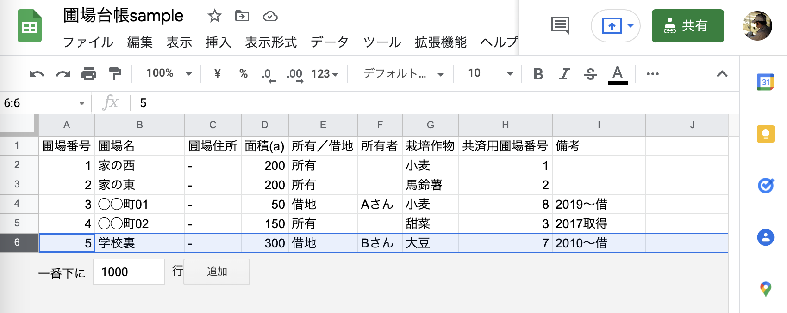

同じ要領で、縦の列についても同様に、空白列を削除することができます。  

データが入っていない最初の列全体（ここではJ列）を選択した状態にして、 **Macなら「Cmd + Shift + →」（Windowsなら「Ctrl + Shift + →」）** を押します。  
行の時と同じように一番右の列まで選択されるので、 **右クリックメニューから「列◯ - ◯を削除」** をクリックしましょう。

以下のように、行・列ともデータの入ったテーブル部分だけが残っていれば完成です。

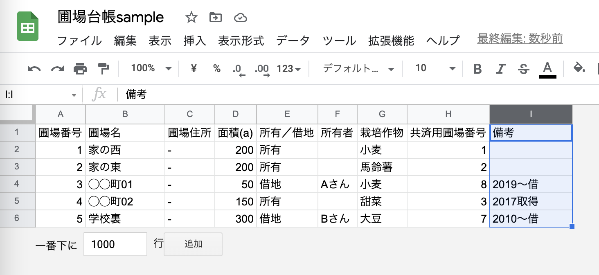

### １行（１列）だけ追加したい場合

空白行が全て無くなってしまいましたが、  

「新たに行を追加して圃場のデータを増やしたい」  
「列を増やして項目を増やしたい」  

というような場合もあるかと思います。

そういった時には、簡単に１行ずつ・１列ずつ挿入することができます。

行を挿入したい場所の行番号をクリックして、先ほどと同じように行全体を選択します。

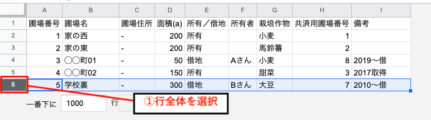

反転している領域のどこかで右クリックして、出てくるメニューの **「下に１行挿入」** （もしくは **「上に１行挿入」** でも可）をクリックすると・・・

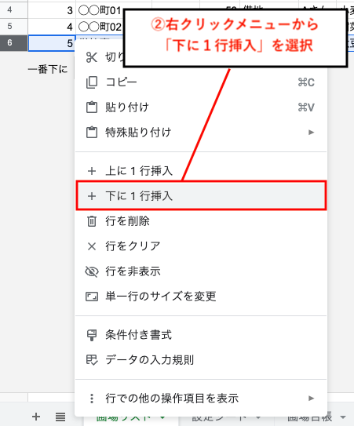

このように、新しい行を追加することができました。

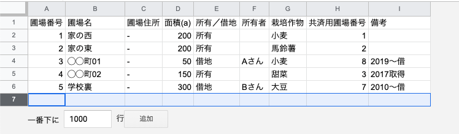

列についても、同様の手順で１行だけ挿入が可能です。

### １行（１列）だけ削除したい場合

先ほど試しに挿入した行は今は不要なので、削除しておきましょう。  

これまでと同じく削除したい行全体を選択したのち右クリックでメニューを出し、**「行を削除」** を選択すると、不要な行を１行だけ削除することができます。

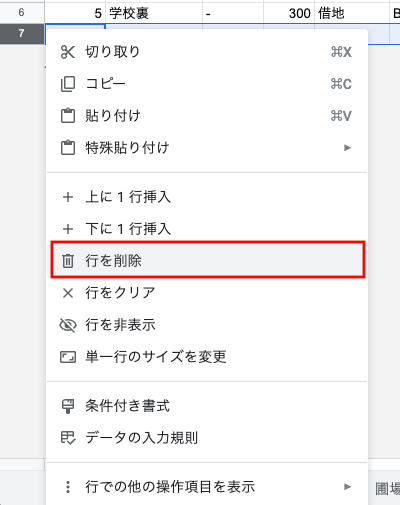

こちらも列についても同様の手順で１行だけ削除ができます

## (2)「交互の背景色」を適用する

次にいよいよ、テーブルに色をつけてみましょう。

地道にセルや行を１つずつ色付け・・・なんてことは、もちろんしません。  
スプレッドシートには **「交互の背景色」** という便利な機能が用意されています。

そのためにまず、テーブル全体のセルを選択します。

**選択したいセル範囲を左上から右下へドラッグ（ここではA1からI6）** すると、指定した範囲全体を選択できます。  
ですが今回のように１シートに１テーブルだけが入っている場合は、もっと簡単な方法があります。**シートの左上にある行番号と列番号が交差する空白部分をクリック**すると、シート内の全てのセルをまとめて選択することが可能です。

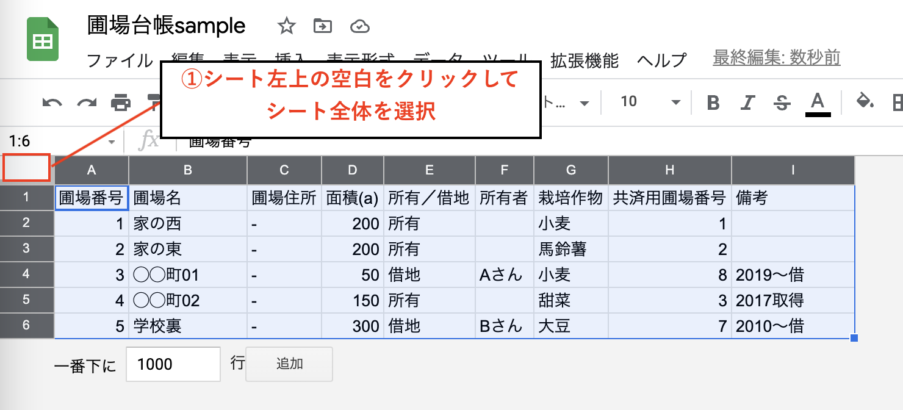

全てのセルが反転されていることを確認したら、スプレッドシートの上部のメニューバーから **「表示形式」** をクリックし、出てくるメニューから **「交互の背景色」** を選択します。

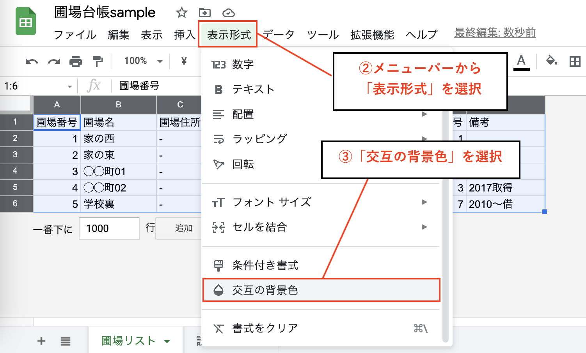

すると画面右側に、設定画面が表示されます。

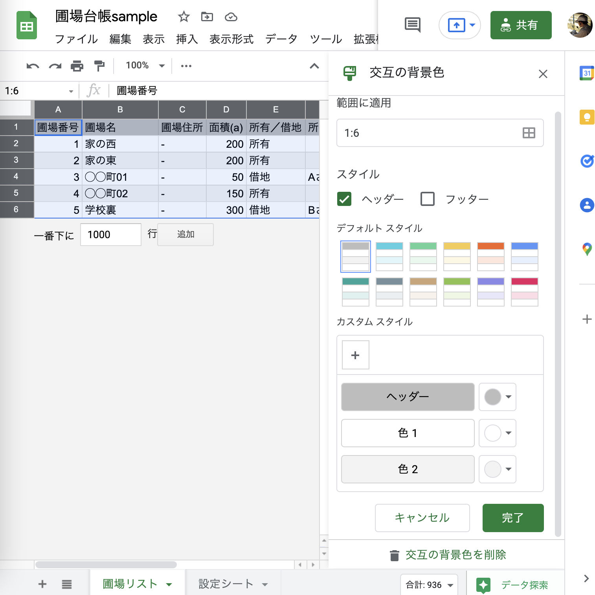

「スタイル」の項目中で「デフォルトスタイル」として用意されているどれか好きなカラーを選択してみましょう。

「ヘッダー」「フッター」のチェックはそのままで大丈夫です。  
（デフォルトでは「ヘッダー」のみにチェックが入っているはずです。）

ここでは、黄色のスタイルを選択してみました。

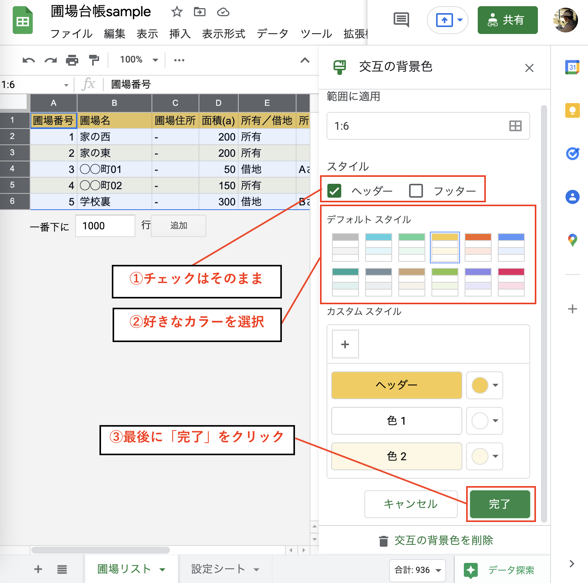

最後に **「完了」をクリック** すると交互の背景色が適用されます。  

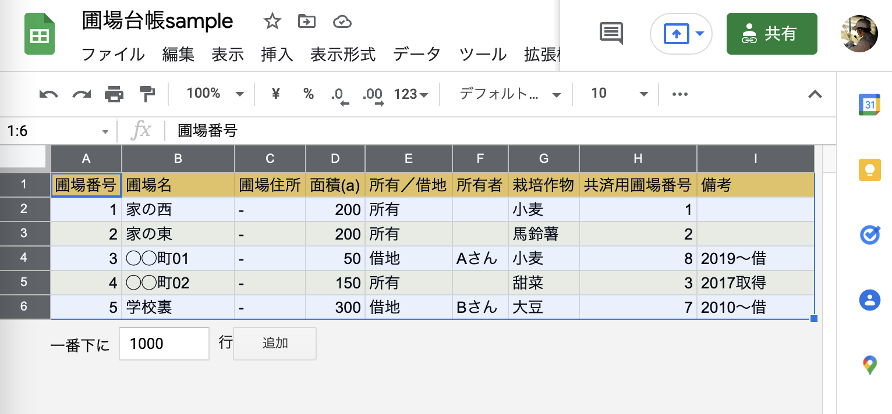

１行目のヘッダーが強調され、各データについては行の色が交互になり見やすい表ができましたね。  

これで、テーブルの見た目の設定も完了です。

解説は省略しますが、もう一つの「設定シート」も同じ要領で、不要な行・列の削除と、交互の背景色の適用を試してみてくださいね。

## まとめ

今回は、スプレッドシートの機能を使って、表の見た目を整えてみました。  
まだまだ便利な機能はたくさんありますが、また必要な時があれば解説したいと思います。

さて、ここまでの一連の記事で、スプレッドシートの簡単な操作方法を学びながら、業務に必要な台帳を作る流れを見てきました。  

実は、ここまではデジタル化のための準備段階にすぎません。  
次回以降で、用意したデータからアプリ化をしていく流れを見ていきたいと思いますので、お楽しみに！